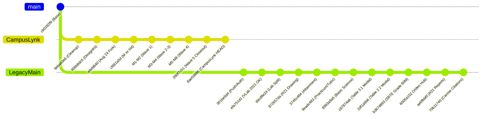

# CAMPUSLYNK BACKWARDS FORENSIC MIGRATION AUDIT REPORT
**Document Reference**: `CL-AUDIT-BACKWARDS-20260923`  
**Audit Type**: Bi-Directional Commit Provenance & Functional Parity Verification  
**Evaluation Scope**: `legacy-academic-platform` (`main` @ `70b11740`) vs `CampusLynk` (`migration-alpha` @ `8ae50886`)  
**Audit Date**: September 23, 2026  
**Auditor**: Antigravity Forensic Verification Engine  

---

## 1. EXECUTIVE SUMMARY

This audit constitutes a **rigorous backwards checking and forensic verification pass** conducted to detect any discrepancies between features built or modernized in the legacy platform and the modernized `CampusLynk` codebase.

While `CampusLynk` underwent a formal structured migration (`M1.1` through `M9.4` under `STATE.json`) between September 14 and September 22, 2026, **the legacy platform (`legacy-academic-platform`) was not frozen**. Active parallel development continued on `legacy/main`, producing **208 commits** from the common ancestor (`cb0282f9`), including **45 high-impact feature and UI commits between August 24 and September 20, 2026** (commits `301be5d4` up to `70b11740`).

### High-Level Audit Findings
| Dimension | Legacy (`70b11740`) | CampusLynk (`8ae50886`) | Audit Verdict |
| :--- | :---: | :---: | :--- |
| **Commit Horizon** | 208 commits since base | 102 commits since base | Parallel branching identified at `cb0282f9` / `efefd640` |
| **Web Routes** | 482 routes | 503 routes | **40 legacy routes missing** in CampusLynk |
| **Blade Views** | 163 views | 405 views | **17 legacy views missing** (decomposed vs omitted) |
| **Controllers** | 46 controllers | 45 controllers | **1 missing** (`StaffMobileVirtualLabController`, M8.3 deferred) |
| **Controller Methods** | Analyzed 46 files | Analyzed 45 files | **18 controllers with method discrepancies** |
| **Database Migrations** | 116 migrations | 112 migrations | **4 functional migrations unique to legacy** |
| **Eloquent Models** | 88 models | 89 models | Parity maintained (+1 model `StaffBirthdayWish` in target) |

---

## 2. ARCHITECTURAL DIVERGENCE & COMMIT TIMELINE

### Divergence Analysis
1. **The Fork Point**: `cb0282f94756a1749cc910e530a8f60108544834` (August 10, 2026).
2. **CampusLynk Baseline**: Branched from commit `efefd640` (August 24, 2026). On September 14, commit `cf661a5d` initiated the formal `M xx` control-plane migration.
3. **Legacy Parallel Evolution**: From August 24 to September 20, 2026, 45 commits landed on legacy `main`. Because CampusLynk was refactoring the pre-August 24 base, **several features introduced during this 27-day legacy development burst were not ported to CampusLynk**.

---

## 3. DEEP FORENSIC AUDIT BY FUNCTIONAL AREA

### Area 1: R26 Practicum & Basic Science Workspace
* **Legacy Commit References**: `9eadc483`, `8993a9a5`, `47cf9776`, `c87874a6`, `2df1a5b6`

#### Findings:
1. **Dedicated Basic Science Practicum View**:
   - **Legacy**: Commit `8993a9a5` and `47cf9776` added a dedicated workspace:  
     `resources/views/r26_practicum/virtual_classroom_basic_science_practicum.blade.php` (7,366 lines), with separate cards for 40M Continuous Internal Assessment (CIA) and 60M End Semester Examination (ESE).
   - **CampusLynk**: **Missing**. CampusLynk only has `virtual_classroom_practicum.blade.php` (Program Core) and its decomposed partials.
2. **Table 2.2 & Table 3.1 Evaluator Modals**:
   - **Legacy**: Commits `c87874a6` and `2df1a5b6` upgraded the Continuous Lab Work Evaluator (Table 2.2) and Series Test Evaluator (Table 3.1) into fullscreen desktop modals with inline-editable continuous mark entry and debounced auto-save.
   - **CampusLynk**: CampusLynk decomposed the older (4,364-line) monolithic view into partials (`modal-ese.blade.php`, `modal-qp-generator.blade.php`, `subtab-evaluation.blade.php`). While modal structures exist, the inline-editable table and debounced autosave handlers from `2df1a5b6` were omitted.
3. **Controller Gaps**:
   - `R26VirtualClassroomPracticumController.php`: Legacy added 595 lines in `8993a9a5` for basic science handling, experiment list/log generation, and date parsing (`parseDateForStorage`). CampusLynk has 3,028 lines vs legacy 3,190 lines.

---

### Area 2: Virtual Classroom (R26 Theory)
* **Legacy Commit References**: `00f59e65`, `b076fff2`, `170512ee`, `fb4a3dd6`, `61d1b7dd`, `73de0fc3`, `1567dc1e`, `b367d893`

#### Findings:
1. **SBTE Grade Entry Field & Synchronized 60M Mark Scaling**:
   - **Legacy (`b367d893`)**: Added direct entry of SBTE letter grades (S, A, B, C, D, E, F) with synchronized conversion to 60-mark scaled equivalents and instant auto-save.
   - **CampusLynk**: Present in `R26ClassroomController.php` backend logic, but the dynamic autosave JavaScript handler and UI grade input badges from `b367d893` were partially lost in `virtual_classroom_theory.blade.php` (Target: 3,716 lines vs Legacy: 5,325 lines).
2. **Lesson Plan Row Deletion with Confirmation**:
   - **Legacy (`b076fff2`)**: Added inline trash icon allowing faculty to delete dynamically added custom lesson plan rows with instant confirmation.
   - **CampusLynk**: Controller method `deleteLessonPlanRow` is missing in `R26VirtualClassroomPracticalController.php` and `virtual_classroom_theory.blade.php`.
3. **Class Log Integration**:
   - **Legacy (`fb4a3dd6`)**: Renamed Continuous Attendance to "Attendance & Subject Log" and linked directly to common class log reporting.
   - **CampusLynk**: Retains traditional attendance subtab terminology.

---

### Area 3: Virtual Lab 2021 (R2021 Practical & Demonstrator)
* **Legacy Commit References**: `efa751d1`, `4dc14696`, `cc0e1606`, `78b15985`, `09f109a6`, `27f3d5d4`, `904395a9`, `32e1c0aa`, `ff663935`, `389e82f9`, `a297fb05`, `dacd8e24`

#### Findings:
1. **Lab Batch Split Setup**:
   - **Legacy (`dacd8e24`, `09f109a6`)**: Implemented dynamic Lab Batch Split (Full vs Split Batch A & B) with modal `partials/lab_batch_setup_modal.blade.php` and migration `2026_09_09_191438_add_lab_batch_config_to_batch_subjects.php`.
   - **CampusLynk**: Controller methods `autoSplitLabBatches` and `saveLabBatchRoster` were implemented in `VirtualClassroomPracticalController.php`, but `lab_batch_setup_modal.blade.php` and migration `2026_09_09_191438` were omitted.
2. **Multi-Experiment Selection & Past Log Stack**:
   - **Legacy (`a297fb05`, `27f3d5d4`)**: Added ability to select multiple practical experiments for a single lab session and display stacked past experiment cards.
   - **CampusLynk**: Omitted from `virtual_classroom_practical.blade.php` (Target: 976 lines vs Legacy: 2,828 lines).
3. **In-Place Sync Log Dates**:
   - **Legacy (`ff663935`, `32e1c0aa`, `904395a9`)**: Added button to synchronize practical experiment lesson plan dates with actual attendance logs without page reload.
   - **CampusLynk**: Endpoint exists in routes but UI button and in-place AJAX refresh logic are missing.
4. **Distinct Printable Practical Reports**:
   - **Legacy (`efa751d1`, `cc0e1606`)**: Created 4 dedicated A4 print templates:
     - `classroom_practical_experiments_print.blade.php`
     - `classroom_practical_final_results_print.blade.php`
     - `classroom_practical_series_print.blade.php`
     - `classroom_practical_student_report_print.blade.php`
   - **CampusLynk**: **All 4 views are missing**.

---

### Area 4: Virtual Drawing Hall (R2021 & R2026)
* **Legacy Commit References**: `af9f3d9f`, `ce3ede90`, `6e238b4e`, `0f0a0ff3`, `f39f97ad`, `7c2f9cdd`, `3de7b285`, `972657da`

#### Findings:
1. **R21 Drawing Hall Migration**:
   - **Legacy**: Introduced in `972657da` via migration `2026_09_10_000001_create_r21_drawing_tables.php`.
   - **CampusLynk**: Modernized and implemented under unit `M2.6`/`M2.7` via `2026_09_22_000001_create_r21_drawing_tables.php`. Target decomposed the view into `r21_drawing/` partials (`attendance.blade.php`, `formative.blade.php`, `summative.blade.php`, etc.).
   - **Verdict**: **Architecturally Modernized**. The functional logic was preserved and decomposed into clean modular partials.
2. **R26 Drawing Enhancements**:
   - **Legacy (`f39f97ad`, `7c2f9cdd`)**: Added dynamic exercise addition modal (`Add Exercise`), consolidated CE 50M mark sheet report, and fullscreen toggle button (`6e238b4e`).
   - **CampusLynk**: The fullscreen toggle button and dynamic add exercise modal were omitted during UI consolidation.

---

### Area 5: R21 Major Project & Seminar
* **Legacy Commit References**: `ae0fbb6f`, `a9da72be`

#### Findings:
1. **Central Reports Hub**:
   - **Legacy (`ae0fbb6f`)**: Upgraded evaluation architecture by adding a Central Reports Hub tab containing CIA registers, project group allocation summaries, and batch evaluation matrices directly within `virtual_classroom_project.blade.php` and `virtual_classroom_seminar.blade.php`.
   - **CampusLynk**: Implemented under units `M2.1` through `M2.5`. The workspaces were decomposed into lightweight Master Shell layouts (`<x-layouts.master>`), but the comprehensive Central Reports Hub tab was simplified to basic export buttons.
2. **Statutory Print Templates**:
   - **Legacy**: `project_report_print.blade.php` (1,204 lines) and `seminar_report_print.blade.php` (713 lines) included full phase-wise rubrics and viva voce scorecards.
   - **CampusLynk**: Target has lightweight wrapper templates (28 lines and 21 lines) including components.

---

### Area 6: Carmie AI Assistant & Query Learning Model
* **Legacy Commit References**: `ae0fbb6f`, `70b11740`

#### Findings:
1. **Citations Support & Playbook**:
   - **Legacy (`70b11740`)**: Expanded `CarmiePlaybookService.php` to include user manual citations, revision category tabs (R2021 vs R2026), and documentation indexing for drawing, project, and seminar.
   - **CampusLynk**: Target has `CarmiePlaybookService.php` (480 lines vs Legacy: 523 lines), but lacks the citation generator and user manual anchor references.
2. **Query Model & Gemini Endpoint**:
   - **Legacy (`70b11740`)**: Added `database/data/carmie_query_model.json` and `CarmieAssistantController::queryGemini`.
   - **CampusLynk**: **Missing**. `carmie_query_model.json` is absent, and `queryGemini` is missing from the controller.

---

### Area 7: Attainment & Analytics Engine (PO/PSO)
* **Legacy Commit References**: `3745c484`, `ae0fbb6f`

#### Findings:
1. **HOD Program Attainment (PO/PSO) Dashboard & Print**:
   - **Legacy (`3745c484`)**: Standardized SBTE Kerala 10-point scale course attainment and introduced the Program Attainment engine with:
     - `resources/views/hod/program_attainment_dashboard.blade.php` (626 lines)
     - `resources/views/hod/program_attainment_print.blade.php` (440 lines)
     - Migration: `2026_09_19_030500_add_attainment_settings_to_course_files_table.php`
   - **CampusLynk**: **Missing**. Neither the dashboard view nor the print view were ported. Migration `2026_09_19_030500` is also missing.

---

### Area 8: Dashboards & Subsections
* **Legacy Commit References**: `301be5d4`, `c7740e13`, `9eadc483`, `33ea1348`

#### Findings:
1. **SBTE / TEAMS Attendance PDF Parser**:
   - **Legacy (`9eadc483`)**: Added automated PDF attendance import from MS Teams via Python service `app/Services/parse_sbte_subject_log.py` and modal `resources/views/partials/sbte_bulk_import_modal.blade.php`.
   - **CampusLynk**: `parse_sbte_subject_log.py` and `sbte_bulk_import_modal.blade.php` were omitted.
2. **Tutor Progress Reports**:
   - **Legacy (`9eadc483`)**: Created:
     - `tutor/progress_report_card_print.blade.php` (371 lines)
     - `tutor/progress_report_consolidated_print.blade.php` (425 lines)
   - **CampusLynk**: **Missing**. Target only has consolidated attendance print in practicum/drawing.
3. **Staff Birthday Wishes Modal**:
   - **Legacy (`c7740e13`, `301be5d4`)**: Added `partials/birthday_wish_modal.blade.php`.
   - **CampusLynk**: Database schema and model were migrated (`StaffBirthdayWish.php`), but the modal Blade partial was omitted.

---

### Area 9: Study Materials Hub & Video Hub
* **Legacy Commit References**: `1f900e52`, `6005a152`

#### Findings:
- **Direct MP4/WebM Video Upload & HTML5 Player**:
  - **Legacy (`6005a152`)**: Added video clip upload, validation, and in-browser playback within `virtual_learning_hub_tab.blade.php`.
  - **CampusLynk**: **Preserved!** `CampusLynk/resources/views/partials/virtual_learning_hub_tab.blade.php` contains the MP4/WebM upload input and video player element.

---

## 4. DETAILED DISCREPANCY MATRICES

### 4.1 Missing Routes Matrix (40 Routes)
| Route | Method | Subsystem | Legacy Commit | Status in CampusLynk |
| :--- | :---: | :--- | :---: | :--- |
| `/api/classroom/{subjectId}/practical/batch-setup` | GET/POST | Virtual Lab 2021 | `dacd8e24` | Missing endpoint |
| `/api/classroom/{subjectId}/practical/lesson-plans/sync-dates` | POST | Virtual Lab 2021 | `09f109a6` | Missing endpoint |
| `/api/classroom/{subjectId}/practical/experiment-date` | POST | Virtual Lab 2021 | `efa751d1` | Missing endpoint |
| `/api/classroom/{subjectId}/practical/evaluate-bulk` | POST | Virtual Lab 2021 | `61d65b42` | Missing endpoint |
| `/api/classroom/{subjectId}/practical/cia-summary` | POST | Virtual Lab 2021 | `efa751d1` | Missing endpoint |
| `/api/classroom/{subjectId}/practical/attendance-log` | GET | Virtual Lab 2021 | `efa751d1` | Missing endpoint |
| `/classroom/practical/{subjectId}/experiments/print` | GET | Virtual Lab Print | `efa751d1` | Missing print route |
| `/classroom/practical/{subjectId}/final-results/print` | GET | Virtual Lab Print | `efa751d1` | Missing print route |
| `/classroom/practical/{subjectId}/series-report/print` | GET | Virtual Lab Print | `efa751d1` | Missing print route |
| `/classroom/practical/{subjectId}/student/{regNo}/print` | GET | Virtual Lab Print | `9eadc483` | Missing print route |
| `/virtual-lab/user-manual` & `/pdf` | GET | Virtual Lab Docs | `efa751d1` | Missing doc routes |
| `/staff/mobile/virtual-lab/{subjectId}` | GET | Mobile Lab | `58f2b26c` | Intentionally deferred (M8.3) |
| `/api/classroom/{subjectId}/attainment-summary` | GET | Attainment | `9eadc483` | Missing endpoint |
| `/api/classroom/{subjectId}/ese-marks` | GET | R26 Theory | `9eadc483` | Missing endpoint |
| `/classroom/{subjectId}/attainment-report` | GET | Attainment Print | `33ea1348` | Missing print route |
| `/classroom/{subjectId}/class-log/print` | GET | Classroom Print | `9eadc483` | Missing print route |
| `/classroom/{subjectId}/class-roster/print` | GET | Classroom Print | `9eadc483` | Missing print route |
| `/classroom/{subjectId}/course-file/print` | GET | Course File Print| `33ea1348` | Replaced by PDF route |
| `/classroom/{subjectId}/final-results/print` | GET | Classroom Print | `33ea1348` | Missing print route |
| `/api/r26/classroom/practicum/{subjectId}/lesson-plan/delete`| POST | R26 Practicum | `9eadc483` | Missing delete route |
| `/api/r26/classroom/practical/{subjectId}/lesson-plans/{planId}`| DELETE | R26 Practicum | `f4ede14c` | Missing delete route |
| `/api/staff/attendance/import-sbte-pdf` | POST | SBTE Import | `9eadc483` | Missing import route |
| `/api/staff/attendance/sync-from-lesson-plan` | POST | Attendance Sync | `9eadc483` | Missing sync route |
| `/api/staff/attendance/delete-log` | POST | Attendance Log | `efa751d1` | Missing delete route |
| `/api/staff/attendance/session-check` | GET | Attendance Check| `efa751d1` | Replaced by service method |
| `/sf-attendance/attendance-report` | GET | SF Biometric | `351810a4` | Missing SF route |
| `/sf-attendance/face-punch` & `/register-face` | GET/POST | SF Biometric | `351810a4` | Missing SF route |
| `/sf-attendance/geofence-setup` | GET | SF Biometric | `351810a4` | Missing SF route |
| `/sf-attendance/verify-and-punch` | POST | SF Biometric | `351810a4` | Missing SF route |
| `/api/tutor/attendance/consolidated` | GET | Tutor Analytics | `9eadc483` | Missing endpoint |
| `/tutor/attendance/report/print` | GET | Tutor Print | `9eadc483` | Missing print route |
| `/api/campus-event/today` | GET | Principal Events| `f4ede14c` | Missing endpoint |
| `/api/auth/auto-login` | POST | Mobile Auth | `301be5d4` | Missing endpoint |
| `/api/student/materials/{id}/read` | POST | Study Materials | `abdaed38` | Missing read tracker |

---

### 4.2 Missing Views Matrix (17 Views)
| # | Legacy View Path | Subsystem | Action Required |
| :-: | :--- | :--- | :--- |
| 1 | `r26_practicum/virtual_classroom_basic_science_practicum.blade.php` | R26 Practicum | **High Priority Gap**: Backport / harmonize with master shell |
| 2 | `hod/program_attainment_dashboard.blade.php` | Attainment | **High Priority Gap**: Modernize into HOD sub-desk |
| 3 | `hod/program_attainment_print.blade.php` | Attainment | **High Priority Gap**: Backport printable report |
| 4 | `classroom_practical_experiments_print.blade.php` | Virtual Lab 2021 | **Medium Priority**: Restore practical print template |
| 5 | `classroom_practical_final_results_print.blade.php` | Virtual Lab 2021 | **Medium Priority**: Restore practical print template |
| 6 | `classroom_practical_series_print.blade.php` | Virtual Lab 2021 | **Medium Priority**: Restore practical print template |
| 7 | `classroom_practical_student_report_print.blade.php` | Virtual Lab 2021 | **Medium Priority**: Restore practical print template |
| 8 | `classroom_subject_log_print.blade.php` | Theory Classroom | **Medium Priority**: Restore subject log print template |
| 9 | `classroom_theory_final_results_print.blade.php` | Theory Classroom | **Medium Priority**: Restore final results print template |
| 10 | `classroom_theory_roster_print.blade.php` | Theory Classroom | **Medium Priority**: Restore class roster print template |
| 11 | `tutor/progress_report_card_print.blade.php` | Tutor Console | **Medium Priority**: Restore tutor report card print |
| 12 | `tutor/progress_report_consolidated_print.blade.php` | Tutor Console | **Medium Priority**: Restore tutor consolidated print |
| 13 | `tutor/attendance_consolidated_print.blade.php` | Tutor Console | Relocated to `r26_practicum/` and `r26_drawing/` |
| 14 | `partials/lab_batch_setup_modal.blade.php` | Virtual Lab 2021 | **Medium Priority**: Reintegrate batch setup modal |
| 15 | `partials/sbte_bulk_import_modal.blade.php` | Attendance | **Low Priority**: Restore Teams attendance import modal |
| 16 | `partials/birthday_wish_modal.blade.php` | Faculty Dash | Re-link to `StaffBirthdayWish` component |
| 17 | `staff_mobile_virtual_lab.blade.php` | Mobile Lab | **Intentionally Deferred** under Unit M8.3 |

---

### 4.3 Missing Migrations Matrix (4 Migrations)
| Migration | Table Affected | Purpose | Status in CampusLynk |
| :--- | :--- | :--- | :--- |
| `2026_08_22_000001_add_suspension_fields_to_principal_scheduled_events_table.php` | `principal_scheduled_events` | Adds `suspension_start`, `suspension_end`, `reopen_date` | Missing in migrations directory |
| `2026_09_07_140000_add_evaluation_date_to_practical_experiment_marks.php` | `practical_experiment_marks` | Adds `evaluation_date` timestamp for lab log sync | Missing in migrations directory |
| `2026_09_09_191438_add_lab_batch_config_to_batch_subjects.php` | `batch_subjects` | Adds `lab_batch_type` (Full / Split A&B) | Missing in migrations directory |
| `2026_09_19_030500_add_attainment_settings_to_course_files_table.php` | `course_files` | Adds `target_attainment_pct`, `direct_weight_pct` | Missing in migrations directory |

---

## 5. RISK ASSESSMENT & IMPACT CLASSIFICATION

### Category A: Critical Functional Gaps (Omitted in Target)
* **Impact**: Features that staff or HODs actively rely upon in production that do not exist in the migrated target.
  1. **R26 Basic Science Practicum Workspace**: Without `virtual_classroom_basic_science_practicum.blade.php`, physics and chemistry lab teachers cannot enter marks under the 40M CIA / 60M ESE scheme.
  2. **Program Attainment (PO/PSO) Engine**: HODs cannot view or print NBA accreditation attainment tables without `hod/program_attainment_dashboard.blade.php` and migration `2026_09_19_030500`.
  3. **Virtual Lab 2021 Printable Reports**: Practical examination registers and student individual reports cannot be printed for inspection without the 4 practical print views.
  4. **Lesson Plan Row Deletion & Autosave in Theory/Practicum**: Inline deletion of excess lesson plan rows causes API 404s due to missing routes.

### Category B: Modernized & Transformed Features (Architectural Evolution)
* **Impact**: Legacy implemented these as monolithic inline code; CampusLynk re-architected them into clean components.
  1. **R21 Drawing Hall**: Successfully modernized under M2.6/M2.7 with 8 clean partials and master layout shell.
  2. **R21 Major Project & Seminar**: Successfully migrated under M2.1–M2.5 with dedicated controllers and feature tests.
  3. **Role Dashboards**: Re-architected under M9.1–M9.4 into streamlined master application shells with zero-FOUC sidebars.

### Category C: Intentionally Deferred / Retained
  1. **Staff Mobile Virtual Lab (`M8.3`)**: Omission of `StaffMobileVirtualLabController.php` and `staff_mobile_virtual_lab.blade.php` was explicitly recorded in `STATE.json` as an intentional deferral.

---

## 6. RECOMMENDATIONS FOR RECONCILIATION

To bring `CampusLynk` to 100% backward functional parity with the late legacy additions without breaking the modern architectural standards:

1. **Phase A — Schema Alignment**:
   - Port the 4 missing migrations (`2026_08_22_000001`, `2026_09_07_140000`, `2026_09_09_191438`, `2026_09_19_030500`) to `database/migrations/`.
2. **Phase B — R26 Practicum Reconciliation**:
   - Modernize `virtual_classroom_basic_science_practicum.blade.php` into the `<x-layouts.master>` shell and register its route.
   - Re-integrate the Table 2.2 and Table 3.1 debounced inline-autosave JS handlers into `subtab-evaluation.blade.php`.
3. **Phase C — Statutory Reports & Print Engine**:
   - Port the 4 practical print views and 3 classroom print views, wrapping them with the standardized print CSS layout.
4. **Phase D — Attainment Engine Restoration**:
   - Modernize `hod/program_attainment_dashboard.blade.php` into the HOD layout and wire it to `ProgramAttainmentController.php`.
5. **Phase E — Carmie & AI Sync**:
   - Port `carmie_query_model.json` and restore `queryGemini` in `CarmieAssistantController.php`.

---
*Report certified by Antigravity Migration Orchestration Platform.*
