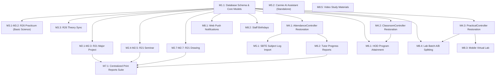

# Feature & Migration Unit Dependency Graph

> **Context:** CampusLynk Autonomous Migration System  
> **Status:** Active Reference  
> **Version:** 0.2.0  

This document visualizes the topological ordering, prerequisites, and cross-cutting dependencies between features and migration units.

---

## 1. High-Level Feature Dependency Topology

---

## 2. Granular Unit Dependency Matrix

| Unit ID | Title | Explicit Prerequisites | Unlocks Downstream | Dependency Classification |
| :--- | :--- | :--- | :--- | :---: |
| **M1.1** | DB Schema & Models Parity | *None* | M2.1, M2.4, M2.6, M3.1, M3.3, M4.1, M4.2, M4.3, M6.1, M8.1, M8.2, M8.4 | **Foundational (Blocker for all)** |
| **M2.1** | R21 Major Project Backend | M1.1 | M2.2 | **Critical Path** |
| **M2.2** | R21 Major Project Workspace | M2.1 | M2.3 | **Critical Path** |
| **M2.3** | R21 Major Project Print Report | M2.2 | M7.1 | **Feature Completion** |
| **M2.4** | R21 Seminar Backend | M1.1 | M2.5 | **Critical Path** |
| **M2.5** | R21 Seminar Workspace & Print | M2.4 | M7.1 | **Feature Completion** |
| **M2.6** | R21 Drawing Backend | M1.1 | M2.7 | **Critical Path** |
| **M2.7** | R21 Drawing Workspace & 4 Prints | M2.6 | M7.1 | **Feature Completion** |
| **M3.1** | R26 Practicum Controller | M1.1 | M3.2 | **Critical Path** |
| **M3.2** | R26 Basic Science Practicum View | M3.1 | *None* | **Feature Completion** |
| **M3.3** | R26 Theory Synchronization | M1.1 | *None* | **Feature Completion** |
| **M4.1** | AttendanceController Restore | M1.1 | M5.1, M6.2 | **Core Infrastructure** |
| **M4.2** | ClassroomController Restore | M1.1 | M6.1 | **Core Infrastructure** |
| **M4.3** | PracticalController Restore | M1.1 | M8.3, M8.4 | **Core Infrastructure** |
| **M5.1** | SBTE Subject Log PDF Import | M4.1 | *None* | **Domain Tool** |
| **M5.2** | Carmie AI Assistant | *None* (Optional `app-shell`) | *None* | **Standalone Subsystem** |
| **M6.1** | HOD Program Attainment Engine | M1.1, M4.2 | *None* | **Domain Engine** |
| **M6.2** | Tutor Progress Reports | M4.1 | M7.1 | **Domain Suite** |
| **M7.1** | Centralized Print Reports Suite | M2.3, M2.5, M2.7, M6.2 | *None* | **Aggregator** |
| **M8.1** | Web Push Notifications | M1.1 | *None* | **Auxiliary** |
| **M8.2** | Staff Birthday Wishes | M1.1 | *None* | **Auxiliary** |
| **M8.3** | Staff Mobile Virtual Lab | M4.3 | *None* | **Auxiliary** |
| **M8.4** | Lab Batch A/B Splitting | M1.1, M4.3 | *None* | **Classroom Add-on** |
| **M8.5** | Video Materials Upload | *None* | *None* | **Standalone Add-on** |

---

## 3. Uncertain & Under-Investigation Dependencies (`UNKNOWN`)

The following linkages have potential hidden couplings in legacy code and are marked `UNKNOWN` pending deep scanning by the Scanner agent:

1. **`M2.2 (R21 Project Workspace)` $\longleftrightarrow$ `M4.1 (AttendanceController)`: [UNKNOWN]**
   - *Question:* Does the R21 Major Project evaluation UI make direct AJAX calls to legacy `AttendanceController` for project session logs, or does it exclusively use `R21VirtualClassroomMajorProjectController`?
   - *Action:* Scanner must inspect all AJAX fetch URLs in `resources/views/r21_project/virtual_classroom_project.blade.php`.
2. **`M3.2 (Basic Science Practicum)` $\longleftrightarrow$ `M8.4 (Lab Batch Splitting)`: [UNKNOWN]**
   - *Question:* Does the 7,398-line Basic Science Practicum view require `batch_subjects.lab_batch_mode` and batch A/B modal logic, or does it operate strictly on unified class batches?
   - *Action:* Scanner must search for `batch_a` / `batch_b` tokens in `virtual_classroom_basic_science_practicum.blade.php`.
3. **`M5.2 (Carmie AI)` $\longleftrightarrow$ `External OpenAI / LLM API Key`: [UNKNOWN]**
   - *Question:* Does `CarmiePlaybookService.php` rely solely on local JSON vector/pattern matching (`carmie_playbook.json`), or does it require an active external API key to function?
   - *Action:* Scanner must verify whether external credentials are required or if it functions completely offline.
