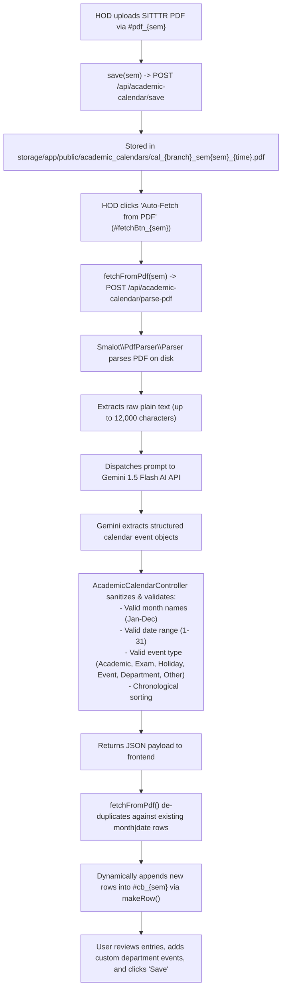

# CAMPUSLYNK — HOD ACADEMIC CALENDAR PLANNER
## PHASE 2C.6 — FORENSIC UI MIGRATION AUDIT & PRESERVATION BASELINE
**Date:** August 22, 2026  
**Auditor:** DeepMind Antigravity AI Engineering Suite  
**Status:** STRICT READ-ONLY / FORENSIC AUDIT COMPLETE (ZERO PRODUCTION FILE MODIFICATIONS)  
**Primary Target:** `resources/views/hod_academic_calendar.blade.php`  
**Primary Controller:** `app/Http/Controllers/AcademicCalendarController.php`  
**Print Target:** `resources/views/hod_academic_calendar_print.blade.php`

---

## 1. Executive Summary

The **HOD Academic Calendar Planner** (`/hod/academic-calendar`) provides Department Heads with a semester-by-semester planning desk for Semesters I through VI. It enables academic administrators to:
1. Configure academic year periods, term commencement dates, and instructional milestones.
2. Upload the official state SITTTR (State Institute of Technical Teachers Training and Research, Kerala) Academic Calendar PDF as an authoritative reference.
3. Automatically parse uploaded SITTTR PDFs using an AI pipeline (**Smalot PDF Parser + Gemini 1.5 Flash AI**) to extract dates, activities, and event classifications into structured tables.
4. Manually edit or prefill standardized semester event templates (exams, internal assessments, holidays, board examinations).
5. Compile and generate official **A4 Printable Departmental Academic Calendars** (`/hod/academic-calendar/{id}/print`) with side-by-side date event lists, color-coded mini monthly grids, working-day calculations, and institutional sign-offs.

### Forensic State:
- **Current UI Architecture:** Standalone legacy Blade view with custom dark background (`#0b0f1a`), Tailwind CSS 2.2.19 CDN, Google Fonts Inter CDN, and Material Symbols Rounded CDN.
- **Backend & AI Engine:** Fully modern Laravel controller (`AcademicCalendarController.php`) with robust JSON serialization, SITTTR PDF parsing, and Gemini 1.5 Flash AI extraction.
- **Print Subsystem:** Dedicated two-column A4 landscape print view (`hod_academic_calendar_print.blade.php`) computing working days and holiday tallies in PHP.

---

## 2. View Architecture & File Breakdown

- **Target File:** [`resources/views/hod_academic_calendar.blade.php`](file:///d:/AMs/academic-platform/carmel-linx-laravel/resources/views/hod_academic_calendar.blade.php) (407 lines)
- **Top-Level Structure:**
  - Standalone `<!DOCTYPE html>`, `<head>` with 3 external CDNs, and custom `<style>` block (58 lines).
  - Standalone `<header>` with custom back button (`/dashboard/hod`), department badge, and Report Centre link (`/hod/report-centre`).
  - `#globalAlert` fixed toast banner for success/error feedback.
  - Information notice box explaining month-wise entry and SITTTR reference guidelines.
  - 6 Semester Accordion Panels (`#panel_1` to `#panel_6`) rendered in a loop (`@for($sem = 1; $sem <= 6; $sem++)`).
  - Embedded client-side `<script>` (160 lines) defining 8 functional handlers and template registries.

---

## 3. Functional Section Inventory

```
Academic Calendar Planner Desk
│
├── 1. Top Bar / Breadcrumb Header
│   ├── Back to HOD Console (/dashboard/hod)
│   ├── Title: Academic Calendar Planner — [Branch] Department
│   └── Link to Report Centre (/hod/report-centre)
│
├── 2. Global Feedback Banner (#globalAlert)
│
├── 3. Instructions & Guidelines Card
│
└── 4. 6-Semester Accordion Workspace Stack (@for $sem = 1..6)
    ├── Semester Panel (#panel_{sem})
    │   ├── Accordion Header (.sem-header, onclick="togglePanel({sem})")
    │   │   ├── Roman Numeral Badge (I, II, III, IV, V, VI)
    │   │   ├── Semester Title & Entry Count (e.g. "2024-2025 • 12 entries")
    │   │   ├── Saved Status Badge (Saved / Not set)
    │   │   ├── Print A4 Action Button (href="/hod/academic-calendar/{id}/print")
    │   │   └── Chevron Toggle (#chevron_{sem})
    │   │
    │   └── Accordion Body (#body_{sem})
    │       ├── Row 1: Academic Year Input (#year_{sem}) & SITTTR PDF Dropzone (#uz_{sem}, #pdf_{sem})
    │       │
    │       ├── Row 2: Month-wise Calendar Entries Table (#ct_{sem}, #cb_{sem})
    │       │   ├── Col 1: Month Selector (.e-month, Jan–Dec)
    │       │   ├── Col 2: Date Number Input (.e-date, 1–31)
    │       │   ├── Col 3: Activity / Description Input (.e-activity)
    │       │   ├── Col 4: Event Type Selector (.e-type: Academic, Exam, Holiday, Event, Department, Other)
    │       │   └── Col 5: Remove Row Button (.remove())
    │       │
    │       └── Row 3: Action Toolbar
    │           ├── Add Row Button (onclick="addRow({sem})")
    │           ├── Auto-Fetch from PDF Button (#fetchBtn_{sem}, #fetchLabel_{sem}, onclick="fetchFromPdf({sem})")
    │           ├── Manual Template Prefill Button (onclick="prefill({sem})")
    │           └── Save Calendar Primary Button (onclick="save({sem})")
```

---

## 4. JavaScript Function Inventory

| Function Name | Purpose | Trigger / Caller | DOM Elements Accessed | API Endpoint Used | Method | Request Payload | Side Effects & State Changes |
|:---|:---|:---|:---|:---|:---:|:---|:---|
| `togglePanel(sem)` | Expands/collapses target accordion body and rotates chevron icon. | `.sem-header` `onclick` | `#body_{sem}`, `#chevron_{sem}`, `.sem-body`, `.chevron` | None | — | — | Toggles `.open` class across all semester accordion panels. |
| `onFile(sem)` | Updates upload dropzone UI upon user file selection. | `#pdf_{sem}` `onchange` | `#pdf_{sem}`, `#uz_{sem}` | None | — | — | Adds `.has-file` class, displays selected filename, and updates dropzone click handler. |
| `makeRow(sem, month, date, activity, type)` | Constructs dynamic table row element (`tr.erow`) with 4 input fields and delete action. | Called by `addRow()`, `prefill()`, and `fetchFromPdf()`. | Dynamic DOM | None | — | — | Returns configured `<tr>` element. |
| `addRow(sem)` | Appends a blank calendar entry row to the semester table. | "Add Row" button `onclick` | `#cb_{sem}` | None | — | — | Appends `makeRow(sem)` to `#cb_{sem}`. |
| `prefill(sem)` | Loads standardized semester milestones (classes commence, assessment weeks, national holidays, board exams). | "Manual Template" button `onclick` | `#cb_{sem}` | None | — | — | Reads `templates[sem]` registry and appends rows to `#cb_{sem}`. |
| `save(sem)` | Serializes year, activity rows, and PDF file into `FormData` and saves to backend. | "Save Calendar" button `onclick` | `#year_{sem}`, `#pdf_{sem}`, `#cb_{sem} .erow`, `.e-month`, `.e-date`, `.e-activity`, `.e-type` | `/api/academic-calendar/save` | `POST` | `FormData` (`semester`, `academic_year`, `activities` JSON string, `pdf` file) | Calls `alert_ok()`, triggers `location.reload()` after 1.3s on success. |
| `fetchFromPdf(sem)` | Dispatches AI extraction request to backend, de-duplicates results against existing table entries, and populates rows. | "Auto-Fetch from PDF" button `onclick` | `#fetchBtn_{sem}`, `#fetchLabel_{sem}`, `#cb_{sem} .erow`, `.e-month`, `.e-date` | `/api/academic-calendar/parse-pdf` | `POST` | JSON: `{ semester: sem }` | Sets button loading state ("⏳ Reading PDF..."), appends parsed rows via `makeRow()`, calls `alert_ok()`. |
| `alert_ok(m)` | Displays transient success toast notification. | Called by `save()` and `fetchFromPdf()`. | `#globalAlert` | None | — | — | Sets `#globalAlert.className = 'ok'` and message for 5s. |
| `alert_err(m)` | Displays transient error toast notification. | Called on fetch/save failure. | `#globalAlert` | None | — | — | Sets `#globalAlert.className = 'err'` and message for 6s. |

---

## 5. DOM Preservation Matrix

### Critical DOM Identifiers (Must NOT be modified or renamed):
| DOM Identifier | Element Type | Criticality | Purpose in Subsystem | JavaScript Consumers |
|:---|:---:|:---:|:---|:---|
| `#globalAlert` | `<div>` | **CRITICAL** | Global toast notification banner | `alert_ok()`, `alert_err()` |
| `#panel_{sem}` (1..6) | `<div>` | **CRITICAL** | Semester panel container wrapper | `togglePanel()` |
| `#chevron_{sem}` (1..6) | `<span>` | **CRITICAL** | Accordion expansion chevron indicator | `togglePanel()` |
| `#body_{sem}` (1..6) | `<div>` | **CRITICAL** | Expandable semester content body | `togglePanel()` |
| `#year_{sem}` (1..6) | `<input>` | **CRITICAL** | Academic year text input field | `save()` |
| `#uz_{sem}` (1..6) | `<div>` | **CRITICAL** | PDF upload dropzone interactive target | `onFile()`, `onclick` trigger |
| `#pdf_{sem}` (1..6) | `<input type="file">` | **CRITICAL** | Hidden file input accepting `.pdf` | `onFile()`, `save()` |
| `#ct_{sem}` (1..6) | `<table>` | **CRITICAL** | Month-wise calendar table | Table container |
| `#cb_{sem}` (1..6) | `<tbody>` | **CRITICAL** | Table body where rows are dynamically appended | `addRow()`, `prefill()`, `fetchFromPdf()`, `save()` |
| `#fetchBtn_{sem}` (1..6) | `<button>` | **CRITICAL** | Auto-Fetch AI extraction trigger button | `fetchFromPdf()` |
| `#fetchLabel_{sem}` (1..6) | `<span>` | **CRITICAL** | Dynamic button label ("Reading PDF..." / "Auto-Fetch") | `fetchFromPdf()` |

### Critical Classes & Selectors:
| Selector / Class | Scope | Criticality | Purpose |
|:---|:---|:---:|:---|
| `.erow` | Table rows | **CRITICAL** | Selected by `querySelectorAll('#cb_' + sem + ' .erow')` for serialization. |
| `.e-month` | Table cell | **CRITICAL** | Month select input (`Jan`..`Dec`). |
| `.e-date` | Table cell | **CRITICAL** | Date number input (`1`..`31`). |
| `.e-activity` | Table cell | **CRITICAL** | Event description text input. |
| `.e-type` | Table cell | **CRITICAL** | Event category select (`Academic`, `Exam`, `Holiday`, `Event`, `Department`, `Other`). |
| `.sem-body` | Accordion bodies | **CRITICAL** | Selected by `document.querySelectorAll('.sem-body')` to close other panels. |
| `.chevron` | Chevron icons | **CRITICAL** | Selected by `document.querySelectorAll('.chevron')` to reset rotation state. |
| `.upload-zone` | File container | **CRITICAL** | Base styling for drag-and-drop dropzone. |
| `.has-file` | File container | **CRITICAL** | Applied when PDF file is attached. |

---

## 6. API & Route Contract

| HTTP Method | Route URI | Controller Method | Auth & Role Requirements | Request Parameters / Body | Response Structure | Consumer |
|:---|:---|:---|:---|:---|:---|:---|
| `GET` | `/hod/academic-calendar` | `AcademicCalendarController@index` | HOD, Principal, Admin (`session('userBranch')`) | None | HTML View (`hod_academic_calendar.blade.php`) with `$calendars`, `$branch` | HOD Report Centre Card 9 |
| `POST` | `/api/academic-calendar/save` | `AcademicCalendarController@store` | HOD, Principal, Admin (`session('userBranch')`) | `FormData`: `semester` (int), `academic_year` (string), `activities` (JSON string), `pdf` (file, optional) | JSON: `{ status: "SUCCESS", id: 12, message: "Semester 3 calendar saved." }` | Client JS `save(sem)` |
| `POST` | `/api/academic-calendar/parse-pdf` | `AcademicCalendarController@parsePdf` | HOD, Principal, Admin (`session('userBranch')`) | JSON: `{ semester: 3 }` | JSON: `{ status: "SUCCESS", count: 14, entries: [ { month: "August", date: "5", activity: "...", type: "Academic" }, ... ] }` | Client JS `fetchFromPdf(sem)` |
| `GET` | `/hod/academic-calendar/{id}/print` | `AcademicCalendarController@printCalendar` | HOD, Principal, Admin (`session('userBranch')`) | `id` (route parameter) | HTML View (`hod_academic_calendar_print.blade.php`) | Semester Panel "Print A4" Button |

---

## 7. SITTTR PDF Parsing Pipeline



---

## 8. Calendar Calculation Engine

The calendar calculation engine operates in **two coordinated tiers**:

### Tier 1: Frontend Milestone Prefill Registry (`templates`)
Defined in client-side JavaScript for rapid manual population:
- **Odd Semesters (1, 3, 5):** Pre-configures June class commencement, August Independence Day, September/October internal assessment weeks, October Gandhi Jayanti, and November board exams.
- **Even Semesters (2, 4, 6):** Pre-configures November class commencement, January Republic Day, February/March internal assessments, and April board exams.

### Tier 2: Backend Working Days & Holiday Calculation Engine (`hod_academic_calendar_print.blade.php`)
Calculated dynamically at print time in PHP:
1. **Academic Year Period Resolution:**
   - Evaluates `$cal->academic_year` (e.g. `2025-2026`).
   - Resolves month-to-year mapping via `resolveYear($mNum, $sem, $startYear, $endYear)`:
     - Odd semesters: Months $\ge 6$ (Jun–Dec) map to `$startYear`; Months $< 6$ map to `$endYear`.
     - Even semesters: Months $\ge 11$ (Nov–Dec) map to `$startYear`; Months $< 11$ (Jan–May) map to `$endYear`.
2. **Day of Week & Sunday Detection:**
   - Iterates through all days of each active month using `cal_days_in_month(CAL_GREGORIAN, $mNum, $year)`.
   - Computes `date('N', strtotime("$year-$mNum-$d"))`.
   - Identifies Sundays (`date('N') == 7`) and applies `.ev-sunday` and `.gc-sun` visual shading.
3. **Working Days Tally Formulation:**
   - A day is classified as an **Instructional Working Day** if it is **NOT a Sunday** and **NOT classified as `type == 'Holiday'`**.
   - Computes per-month metrics:
     $$\text{Working Days} = \text{Total Days in Month} - \text{Sundays} - \text{Declared Holidays}$$
   - Compiles Grand Total Working Days across the entire semester layout.

---

## 9. Storage & Database Dependencies

### Database Table: `academic_calendars`
```sql
CREATE TABLE `academic_calendars` (
  `id` bigint(20) unsigned NOT NULL AUTO_INCREMENT,
  `branch` varchar(50) NOT NULL,
  `semester` int(11) NOT NULL,
  `academic_year` varchar(20) NOT NULL,
  `pdf_path` varchar(255) DEFAULT NULL,
  `activities` longtext DEFAULT NULL,
  `created_at` timestamp NULL DEFAULT NULL,
  `updated_at` timestamp NULL DEFAULT NULL,
  PRIMARY KEY (`id`),
  KEY `academic_calendars_branch_semester_index` (`branch`,`semester`)
);
```

### JSON Schema for `activities` Column:
```json
[
  {
    "month": "August",
    "date": "5",
    "activity": "Commencement of classes for Semester III",
    "type": "Academic"
  },
  {
    "month": "August",
    "date": "15",
    "activity": "Independence Day",
    "type": "Holiday"
  },
  {
    "month": "September",
    "date": "16",
    "activity": "Milad-un-Nabi",
    "type": "Holiday"
  },
  {
    "month": "October",
    "date": "14",
    "activity": "First Series Assessment Exam begins",
    "type": "Exam"
  }
]
```

### Storage Filesystem:
- Path: `storage/app/public/academic_calendars/cal_{branch}_sem{sem}_{timestamp}.pdf`
- Public URL: `/storage/academic_calendars/...` (symlinked via `php artisan storage:link`).

---

## 10. Print Pipeline & Document Forensics

- **Print Route:** `GET /hod/academic-calendar/{id}/print`
- **Controller Method:** `AcademicCalendarController@printCalendar`
- **Print View File:** [`resources/views/hod_academic_calendar_print.blade.php`](file:///d:/AMs/academic-platform/carmel-linx-laravel/resources/views/hod_academic_calendar_print.blade.php) (620 lines)
- **Document Layout:**
  - Standard **A4 Landscape** (`@page { size: A4 landscape; margin: 0.5cm; }`).
  - **Two-Column Layout per Month Block:**
    - Left Column (58%): Sequential day-by-day activity roster with color-coded dot badges.
    - Right Column (42%): Mini monthly calendar matrix with date numbers shaded by event category.
  - **Summary Section:** Comprehensive semester working days tally table and official Principal & HOD sign-off blocks.
- **Migration Directive:** **DO NOT MODIFY DURING UI MIGRATION**.

---

## 11. Design System Violations (Interactive UI)

| Violation Category | Quantified Count | Observation in `hod_academic_calendar.blade.php` |
|:---|:---:|:---|
| **External CDN Links** | 3 instances | `tailwindcss@2.2.19` CDN, Google Fonts `Inter`, `Material Symbols Rounded` CDN. |
| **Legacy Dark Backgrounds** | Entire view | Uses `#0b0f1a` (body canvas), `#090b14` (header), `#0f172a` (inputs/tables), and `rgba(15,23,42,0.7)`. |
| **Micro-Fonts (<14px)** | 8 instances | Uses `11px` (labels, table headers), `12px` (subtitles, badges), and `13px` (inputs, buttons). |
| **Raw Inline Styles** | 42 instances | Extensive inline `style="..."` attributes on headers, tables, inputs, buttons, and dropzones. |
| **Isolated Shell & Header** | 1 instance | Standalone `<html>` / `<head>` with custom header and back button instead of standard CampusLynk App Shell. |
| **Custom Color Gradients** | 6 semester badges | Custom classes (`.a1`..`.a6`, `.b1`..`.b6`, `.i1`..`.i6`) with custom border/background hex codes. |

---

## 12. CampusLynk Component Mapping

| Existing Legacy Element | Current Legacy Usage | CampusLynk Target Component / Styling |
|:---|:---|:---|
| Standalone `<html>` / `<body>` | Standalone dark page | `<x-layouts.app-shell title="CampusLynk - Academic Calendar Planner" topbarTitle="Academic Calendar" activeNav="report_centre">` |
| Header & Back Link | Custom header with back button | Breadcrumb: `Report Centre / Academic Calendar Planner` + Header overview card with `calendar-range` icon |
| Info Box | Dark amber notice box | Clean blue notice card (`bg-blue-50/60 border border-blue-200/80 rounded-2xl p-4.5 text-sm text-blue-900`) with Lucide `info` icon |
| Semester Accordion Panel (`#panel_{sem}`) | Dark container (`rgba(15,23,42,0.7)`) | Clean white card (`bg-white border border-slate-200/80 rounded-2xl shadow-xs overflow-hidden transition-all duration-200`) |
| Accordion Header (`.sem-header`) | Dark header with custom colored badges | Clean header with blue/indigo semester badges, 15px bold titles, Lucide `check-circle-2`, `printer`, `chevron-down` icons |
| PDF Dropzone (`#uz_{sem}`) | Dark dashed box with inline CSS | Clean dropzone (`bg-slate-50/60 border-2 border-dashed border-slate-200 hover:border-blue-400 rounded-xl p-4.5 text-center cursor-pointer`) |
| Calendar Entries Table (`#ct_{sem}`) | Dark table with 11px headers | Clean table (`bg-white border border-slate-200 rounded-xl`) with 12px uppercase slate headers and 14px inputs |
| Input Controls (`.finput`, `.e-month`, etc.) | Dark `#0f172a` inputs with 13px text | Clean `<x-ui.select>` / `<input>` (`bg-white border border-slate-200 rounded-xl px-3.5 py-2.5 text-sm text-slate-900 focus:border-blue-600`) |
| Action Buttons | Raw dark buttons with Material Symbols | CampusLynk standard buttons (`bg-blue-600 hover:bg-blue-700 text-white rounded-xl font-medium text-sm`) with Lucide icons |

---

## 13. Risk Assessment

| Section / Component | Risk Level | Rationale | Mitigation Strategy |
|:---|:---:|:---|:---|
| **SITTTR PDF Parser & AI Extraction** | **LOW** | Handled 100% by backend controller (`/api/academic-calendar/parse-pdf`). | Preserve `#fetchBtn_{sem}` and `#fetchLabel_{sem}` IDs and `fetchFromPdf()` handler verbatim. |
| **Dynamic Row Construction (`makeRow`)** | **LOW** | Client-side DOM creation. | Preserve exact class names (`.erow`, `.e-month`, `.e-date`, `.e-activity`, `.e-type`) and select options. |
| **Calendar Save Pipeline (`save`)** | **LOW** | `FormData` serialization relies on exact class selectors. | Preserve `.erow`, `#year_{sem}`, `#pdf_{sem}` inputs and `/api/academic-calendar/save` contract. |
| **Accordion Interactivity (`togglePanel`)** | **LOW** | Simple class toggling (`.open`). | Modernize CSS transition rules while preserving `#body_{sem}` and `#chevron_{sem}` IDs. |
| **Print Output Pipeline** | **ZERO** | Dedicated A4 template (`hod_academic_calendar_print.blade.php`). | 100% Untouched and preserved. |

---

## 14. Migration Boundary

```
┌─────────────────────────────────────────────────────────────────────────────┐
│ 🟢 SAFE TO MODIFY (UI & PRESENTATION LAYER)                                 │
├─────────────────────────────────────────────────────────────────────────────┤
│ • Wrap in <x-layouts.app-shell> and remove standalone <html>/<head>/<body> │
│ • Remove Tailwind 2.2 CDN, Google Fonts Inter CDN, Material Symbols CDN     │
│ • Replace dark #0b0f1a background with #FAFAFB canvas and #FFFFFF cards     │
│ • Upgrade typography to Poppins with 14px minimum control font sizes        │
│ • Replace Material Symbols with native Lucide icons                         │
│ • Modernize PDF dropzone and action button styles                            │
│ • Implement responsive layout (1440px desktop / 768px tablet / 375px mobile)│
└─────────────────────────────────────────────────────────────────────────────┘

┌─────────────────────────────────────────────────────────────────────────────┐
│ 🔴 DO NOT MODIFY (CORE BUSINESS LOGIC & PERSISTENCE LAYER)                  │
├─────────────────────────────────────────────────────────────────────────────┤
│ • DO NOT modify routes in routes/web.php                                    │
│ • DO NOT modify AcademicCalendarController.php                              │
│ • DO NOT modify Smalot PDF Parser or Gemini 1.5 Flash AI extraction prompt  │
│ • DO NOT modify hod_academic_calendar_print.blade.php print template        │
│ • DO NOT modify academic_calendars database schema or activities JSON format│
│ • DO NOT modify JavaScript function names or parameter contracts            │
│ • DO NOT modify critical DOM IDs (#year_{sem}, #pdf_{sem}, #cb_{sem}, etc.) │
└─────────────────────────────────────────────────────────────────────────────┘
```

---

## 15. Recommended Migration Sequence (Phase 2C.6 Roadmap)

When authorized to execute Phase 2C.6, follow this exact sequence:
1. **Phase A — Shell & Topbar Integration:** Wrap `hod_academic_calendar.blade.php` in `<x-layouts.app-shell>`, establishing breadcrumb context and removing standalone HTML/head and CDN tags.
2. **Phase B — Accordion Stack & Card Modernization:** Convert the 6 semester panels into clean CampusLynk white cards with polished header badges, entry counters, and action triggers.
3. **Phase C — PDF Dropzone & Calendar Table Modernization:** Style `#uz_{sem}`, `#ct_{sem}`, and `makeRow()` inputs with clean slate borders and 14px typography.
4. **Phase D — Action Bar & Lucide Icons:** Modernize Add Row, Auto-Fetch from PDF, Manual Template, and Save Calendar buttons with Lucide icons (`plus`, `sparkles`, `file-text`, `save`).
5. **Phase E — JavaScript & AI Integration Verification:** Test `fetchFromPdf()`, `prefill()`, `addRow()`, and `save()` handlers across all 6 semesters.
6. **Phase F — Print Pipeline Verification:** Verify that `/hod/academic-calendar/{id}/print` continues rendering pixel-perfect A4 calendars.
7. **Phase G — Build & Regression Testing:** Execute `npm.cmd run build` and clear Laravel view/route/config caches.

---

## 16. Academic Calendar Migration Baseline

```
============================================================
ACADEMIC CALENDAR MIGRATION BASELINE
============================================================

View:
resources/views/hod_academic_calendar.blade.php

Route:
/hod/academic-calendar

Functional Sections:
4 major workspaces (Header, Notice, 6-Sem Accordion Stack, Table/Action Bar)

JavaScript Functions:
8 functions (togglePanel, onFile, makeRow, addRow, prefill, save, fetchFromPdf, alert_ok/err)

Critical DOM IDs:
11 distinct identifier patterns (#globalAlert, #panel_{1..6}, #chevron_{1..6}, #body_{1..6}, #year_{1..6}, #uz_{1..6}, #pdf_{1..6}, #ct_{1..6}, #cb_{1..6}, #fetchBtn_{1..6}, #fetchLabel_{1..6})

API / Route Dependencies:
3 endpoints (GET /hod/academic-calendar, POST /api/academic-calendar/save, POST /api/academic-calendar/parse-pdf)

Print Dependencies:
1 dedicated template (GET /hod/academic-calendar/{id}/print -> hod_academic_calendar_print.blade.php)

SITTTR Parser:
PRESENT (Smalot PDF Parser + Gemini 1.5 Flash AI in AcademicCalendarController@parsePdf)

Business Logic Risk:
LOW (Backend AI extraction & PHP working-day calculations untouched)

UI Migration Risk:
LOW (Clean 1:1 mapping to CampusLynk App Shell & components)

Recommended Shell:
<x-layouts.app-shell title="CampusLynk - Academic Calendar Planner" topbarTitle="Academic Calendar" activeNav="report_centre">

Recommended Next Step:
UI migration after baseline approval (Phase 2C.6)
============================================================
```
