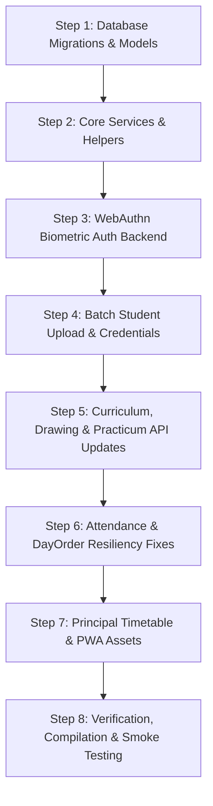

# CampusLynk — Legacy Feature Delta Audit & Forensic Analysis

**Audit Date:** August 20, 2026  
**Source Repository (Legacy Reference):** `https://github.com/MaxonXOXO/academic-platform` (Commit `99c4137`)  
**Target Repository (Authoritative Workspace):** `d:\AMs\academic-platform` (Commit `dfba441`)  
**Fork Base Commit:** `cb0282f` (August 11, 2026)  
**Total Legacy Commits Audited:** 142 commits  

---

## 1. Executive Summary

During the parallel development week (Aug 11 – Aug 20, 2026), the **Target Codebase** underwent a foundational **UI Overhaul & Architectural Modernization** (complete Tailwind/Vanilla design system, responsive app shells, 14px+ minimum typography standards, modular navigation, accessible modals, and modern HOD/Principal dashboards). 

Concurrently, the **Legacy Repository** implemented crucial **backend features, algorithm refinements, data model enhancements, mobile capabilities, and bug fixes**:
1. **WebAuthn FIDO2 Biometric Authentication**: Touch ID / Face ID / Android fingerprint login for staff with credential management.
2. **Student Bulk Roster Ingestion & Onboarding**: Automated Excel/CSV parser (handling official Joining Lists such as `Regular.xls`), credentials batch generator/printer, and first-time login profile completion workflow.
3. **Curriculum & Accreditation Upgrades**: Full CO-PO-PSO matrix mapping (PO1–PO11, PSO1–PSO3), dynamic continuous evaluation (CE) drawing exercise addition, consolidated CE 50M student reports, and practicum timetable/course-file preparation.
4. **Attendance & Day Order Resiliency**: Centralized `DayOrderService`, `adm_no` fallback for student attendance, parallel lab timetable slots aggregation, and automated `actual_date` sync on lesson plan execution.
5. **Progressive Web App (PWA) Support**: Web manifest, service worker caching, and smart mobile install prompt.
6. **Avatar Zoom & Focal Framing**: Coordinate and scale persistence (`avatar_zoom`, `avatar_pos_x`, `avatar_pos_y`) for staff profile portraits.

This audit establishes a safe, non-destructive migration roadmap to port these missing capabilities into the current modern architecture **without regressing any modern UI components or design rules**.

---

## 2. Feature Delta Matrix

| Feature Domain | Legacy Implementation | Current Implementation | Status | Priority | Dependencies | Recommendation |
| :--- | :--- | :--- | :--- | :--- | :--- | :--- |
| **WebAuthn Biometric Login** | `WebAuthnController.php`, FIDO2 options, registration & verification | None | Missing | `MUST MIGRATE` | `StaffBiometricCredential` model, migration | Migrate controller, model, migration, and adapt to modern auth layout |
| **Batch Student Roster Upload** | `BatchStudentUploadController.php` (Excel/CSV parser, audit trail, stats) | None | Missing | `MUST MIGRATE` | `students` table migration, `AuditLog` | Migrate controller, add upload modal to modern User Directory |
| **Batch Student Credentials Print** | `batch_student_credentials_print.blade.php` | None | Missing | `MUST MIGRATE` | Route `/hod/batches/{id}/credentials/print` | Port print template with modern A4 print styling |
| **Student First-Login Profile Onboarding** | `completeFirstLoginProfile` endpoint | None | Missing | `MUST MIGRATE` | `students` table guardian/income fields | Migrate endpoint in `BatchStudentUploadController` |
| **CO-PO-PSO Matrix (PO1-PO11, PSO1-PSO3)** | `saveTheoryCoPoMapping`, `saveCoPoMatrix` | Fixed CO-PO | Missing | `MUST MIGRATE` | `ClassroomController`, `R26VirtualClassroomPracticumController` | Port matrix saving endpoints across theory & practicum |
| **Dynamic Drawing Exercises (CE 50M)** | `addExerciseApi`, `printExerciseList`, `printCeConsolidatedReport` | Static Drawing | Missing | `MUST MIGRATE` | `R26VirtualClassroomDrawingController` | Port controller methods and 2 print views |
| **Centralized Day Order Service** | `DayOrderService.php` | Inline file reads | Refactoring | `MUST MIGRATE` | None | Port `DayOrderService.php` and standardize calls |
| **Student Attendance `adm_no` Fallback & Parallel Slots** | Handled in `StudentAttendanceController` | Strictly `reg_no` | Bug Fix / Enhancement | `MUST MIGRATE` | `StudentAttendanceController` | Port resilient querying & parallel slot logic |
| **Lesson Plan Actual Date Auto-Sync** | Updated on attendance save | Manual | Bug Fix | `MUST MIGRATE` | `StudentAttendanceController@saveAttendance` | Port unconditional `actual_date` update |
| **Avatar Zoom & Focal Framing** | `saveStaffAvatarFraming`, zoom coordinates in DB | Fixed avatar crop | Missing | `SHOULD MIGRATE` | `staff_profiles` migration, `DataController` | Port migration and persistence endpoint |
| **Principal's Master Timetable Desk** | `PrincipalDashboardController.php`, `/principal/today-timetable` | None | Missing | `SHOULD MIGRATE` | `principal_today_timetable.blade.php` | Port controller & adapt view to modern app shell |
| **Active Flash Notices API** | `ExecutiveFlashNoticeController@getActiveNotices` | Partial | Missing | `SHOULD MIGRATE` | None | Port missing endpoint |
| **Database Restore Endpoint** | `BackupController@restoreDatabase` | Backup only | Missing | `SHOULD MIGRATE` | `BackupController` | Port restore method with security validation |
| **PWA Web App Manifest & Service Worker** | `manifest.json`, `sw.js`, icons | None | Missing | `SHOULD MIGRATE` | `public/` assets | Port manifest, service worker, and icons |
| **SF Attendance on HOD Dashboard** | Present in legacy | Cleanly removed per user directive | Conflict | `DO NOT MIGRATE` | None | Maintain user rule: keep HOD dashboard clean |

---

## 3. Route Delta

### Missing Legacy Routes to Migrate:

```
[POST]   /api/webauthn/register-options                          -> WebAuthnController@getRegisterOptions
[POST]   /api/webauthn/register                                  -> WebAuthnController@registerCredential
[POST]   /api/webauthn/auth-options                              -> WebAuthnController@getAuthOptions
[POST]   /api/webauthn/authenticate                              -> WebAuthnController@authenticate
[GET]    /api/webauthn/credentials                               -> WebAuthnController@listUserCredentials
[DELETE] /api/webauthn/credentials/{id}                          -> WebAuthnController@deleteCredential

[POST]   /api/admin/batch-student-upload                         -> BatchStudentUploadController@uploadBatchStudents
[POST]   /api/students/bulk-import                               -> DataController@bulkImportStudents
[GET]    /api/students/template/download                         -> DataController@downloadStudentImportTemplate
[POST]   /api/student/complete-first-login-profile               -> BatchStudentUploadController@completeFirstLoginProfile
[GET]    /hod/batches/{classroomId}/credentials/print            -> BatchStudentUploadController@printBatchStudentCredentials

[POST]   /api/classroom/{subjectId}/copo-mapping/save            -> ClassroomController@saveTheoryCoPoMapping
[DELETE] /api/classroom/{subjectId}/lesson-plans/{planId}        -> ClassroomController@deleteLessonPlanRow
[POST]   /api/classroom/{subjectId}/save-lesson-plans            -> ClassroomController@bulkUpdateLessonPlans

[GET]    /api/r26/classroom/{subjectId}/ese-marks                -> R26ClassroomController@getEseMarks
[GET]    /api/r26/classroom/{subjectId}/attainment-summary       -> R26ClassroomController@getAttainmentSummary

[POST]   /api/r26/classroom/practicum/course-file/{subjectId}/save-doc -> R26VirtualClassroomPracticumController@saveCourseFileDoc
[GET]    /r26/classroom/practicum/{subjectId}/print-timetable   -> R26VirtualClassroomPracticumController@printClassroomTimetable
[POST]   /api/r26/classroom/practicum/{subjectId}/copo-matrix/save -> R26VirtualClassroomPracticumController@saveCoPoMatrix

[POST]   /api/r26/classroom/drawing/{subjectId}/exercises/add    -> R26VirtualClassroomDrawingController@addExerciseApi
[GET]    /r26/classroom/drawing/exercises/print/{subjectId}      -> R26VirtualClassroomDrawingController@printExerciseList
[GET]    /r26/classroom/drawing/ce-consolidated/print/{subjectId}-> R26VirtualClassroomDrawingController@printCeConsolidatedReport

[GET]    /dashboard/principal/today-timetable                    -> PrincipalDashboardController@showTodayTimetable
[GET]    /api/principal/today-timetable                          -> PrincipalDashboardController@getTodayTimetableData

[POST]   /api/staff/profile/save-avatar-framing                  -> DataController@saveStaffAvatarFraming
[POST]   /api/student/profile/update-self                        -> DataController@updateSelfStudentProfile
[POST]   /api/student/update-email                               -> DataController@updateStudentEmail
[GET]    /api/flash-notices/active                               -> ExecutiveFlashNoticeController@getActiveNotices
[POST]   /api/system/restore                                     -> BackupController@restoreDatabase
```

---

## 4. Data Model & Migration Delta

### New Database Migrations to Port:
1. `database/migrations/2026_08_18_000001_create_staff_biometric_credentials_table.php`
   - Creates `staff_biometric_credentials` (`id`, `user_id`, `credential_id`, `public_key`, `device_name`, `counter`, `transports`, timestamps).
2. `database/migrations/2026_08_18_000002_add_avatar_zoom_and_pos_to_staff_profiles.php`
   - Adds `avatar_zoom` (float, default 1.0), `avatar_pos_x` (int, default 50), `avatar_pos_y` (int, default 50) to `staff_profiles`.
3. `database/migrations/2026_08_17_000001_add_batch_upload_columns_to_students_table.php`
   - Adds `annual_income`, `residential_status`, `guardian_name`, `guardian_address`, `guardian_relationship`, `guardian_mobile`, `scholarships`, `is_fee_waiver`, `profile_verified_at`, `profile_verified_by` to `students` table.
4. `database/migrations/2026_08_12_000001_create_ams_telemetry_and_syllabus_metadata_tables.php`
   - Creates `ams_telemetry_logs` and `syllabus_metadata` tables.
5. `database/migrations/2026_08_12_000002_add_cia_ese_credits_to_syllabus_registry_table.php`
   - Adds `cia_marks`, `ese_marks`, `credits` to `syllabus_registry`.

### Model Updates:
- `app/Models/StaffBiometricCredential.php` [NEW]
- `app/Models/Student.php` [UPDATE: fillable fields & casts for guardian/income data]

---

## 5. Bug Fix Delta

1. **Undefined `$dayMap` & `adm_no` Fallback in `StudentAttendanceController`**:
   - In legacy commit `99c4137`, fixed an undefined variable `$dayMap` error and added `$studentIds = array_filter([$student->reg_no, $student->adm_no])` so students admitted without a register number can load attendance, leaves, and today's timetable.
2. **Attendance Lesson Plan Synchronization**:
   - In legacy commit `5588853`, whenever staff saves attendance for a period, `actual_date` in `lesson_plans` is synchronized to the attendance date.
3. **Module Extraction with Spaces in Syllabus Parser**:
   - In legacy commit `a08aea7`, Course Outcomes with spaces (e.g., `CO 1`, `CO  2`) in syllabus PDFs now parse cleanly without truncation.
4. **Drawing Lesson Plan Empty Topic Rows**:
   - In `R26VirtualClassroomDrawingController@bulkUpdateLessonPlans`, blank or empty topic rows are discarded safely without creating phantom hours.

---

## 6. UI & Architecture Conflicts & Resolution

| Legacy Implementation Pattern | Conflict with Current Architecture | Resolution Standard |
| :--- | :--- | :--- |
| Standalone dark blade views with ad-hoc colors (`#020617`, `#0f172a`) | Violates modern light design system & layout components | Re-render using `components.layouts.app-shell` and design tokens (`bg-slate-50`, `border-slate-200`, `text-sm` minimum font) |
| Hardcoded font sizes (`text-[10px]`, `text-xs` on forms) | Violates workspace rule: $\ge 14\text{px}$ (`text-sm` / `text-base`) | Enforce minimum `text-sm` on all inputs, labels, and data tables |
| Legacy SF Attendance links across headers | Violates user directive to keep HOD console clean | Keep HOD navigation clean; retain SF backend logic only for mobile faculty |
| Copy-pasting full Blade files | Overwrites modern layouts | Only extract functional JavaScript/API logic and embed into current UI components |

---

## 7. Step-by-Step Migration Implementation Plan



### Execution Steps:
1. **Migrations & Models**: Port 5 missing migrations, run `php artisan migrate`, update `Student.php`, add `StaffBiometricCredential.php`.
2. **Services**: Port `DayOrderService.php` and `AmsDiagnosticLogger.php`.
3. **WebAuthn Biometrics**: Port `WebAuthnController.php` and register API routes.
4. **Batch Student Upload**: Port `BatchStudentUploadController.php`, register routes, port `batch_student_credentials_print.blade.php`.
5. **Academic Engine**: Update `ClassroomController.php`, `R26ClassroomController.php`, `R26VirtualClassroomDrawingController.php`, `R26VirtualClassroomPracticumController.php`, port 3 drawing/practicum print views.
6. **Attendance & Bug Fixes**: Port fixes in `StudentAttendanceController.php`, `DataController.php`, `ExecutiveFlashNoticeController.php`, `BackupController.php`.
7. **Timetable & PWA**: Port `PrincipalDashboardController.php`, port `principal_today_timetable.blade.php`, copy PWA assets (`manifest.json`, `sw.js`, icons).
8. **Testing**: Run Vite build (`npm run build`), clear Laravel caches, test all APIs.
