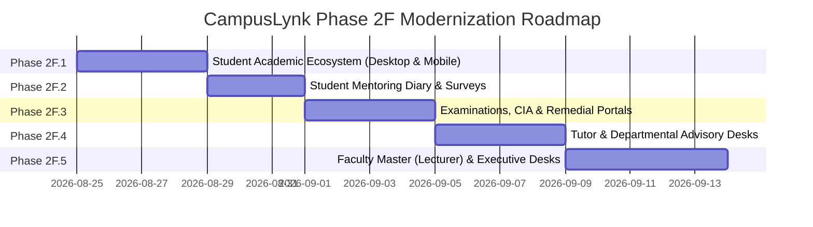

# CAMPUSLYNK — PHASE 2F FORENSIC DISCOVERY & MODERNIZATION ROADMAP
## Complete Inventory, Architecture Mapping & Execution Strategy for Remaining Subsystems

**Status:** `READ-ONLY FORENSIC DISCOVERY COMPLETED`  
**Phase:** `Phase 2F — Non-Classroom Application Modernization`  
**Date:** August 2026  
**Auditor:** DeepMind Antigravity Cognitive Core  
**Standard:** Revision 2026 High-Contrast Slate / Light-Theme UI System

---

## 1. Executive Summary

With **Phase 2E (Virtual Classroom Ecosystem)** officially completed, audited, and certified production-safe with **zero regressions**, the modernization program shifts focus to the **remaining subsystems** of CampusLynk.

A full forensic scan across the repository (`carmel-linx-laravel`) was conducted to catalog every remaining interface, database table, controller, route, and legacy pattern.

### Key Metrics from Repository Scan
* **Total Routes Registered:** 443
  * Student-Specific Routes: 50
  * Examination / Assessment Routes: 12 (Core) + 40 (Integrated in Classrooms & Dashboards)
  * HOD & Departmental Routes: 53
  * Admin / Executive Desk Routes: 30
  * Virtual Classroom (R26) Modern Routes: 90
  * Print & PDF Generation Routes: 8+
  * Specialized API Endpoints: 136
* **Database Schema:** 107 Tables, 80 Eloquent Models
* **Blade Views Remaining Outside R26 Classroom:** 37 Views (~1.8 million bytes / 35,000 lines of template and JS code)
* **Design Violation Findings:** Multiple legacy views contain `glass-card`, `backdrop-blur`, `bg-slate-950/900`, neon accents (`cyan-400`, `emerald-400`), and standalone `<html>` wrappers bypassing the modern `<x-layouts.app-shell>` component.

---

## 2. Complete Inventory of Remaining Subsystems

The remaining unmigrated surfaces fall into **four distinct functional pillars**:

```mermaid
graph TD
    A[Remaining CampusLynk Surfaces] --> B[Pillar 1: Student Academic Ecosystem]
    A --> C[Pillar 2: Examination & Evaluation Engine]
    A --> D[Pillar 3: Legacy Faculty & Advisory Desks]
    A --> E[Pillar 4: Executive & Institutional Control Desks]

    B --> B1[Student Desktop Dashboard]
    B --> B2[Student Mobile Dashboard]
    B --> B3[Student Mentoring Diary & Surveys]
    B --> B4[Online Mock Test Engine]

    C --> C1[CIA Series Test Engine]
    C --> C2[Practical Evaluation & Daywork]
    C --> C3[Seminar & Assignment Portals]
    C --> C4[Remedial & Backlog Tracker]

    D --> D1[Lecturer Dashboard R2021]
    D --> D2[Tutor Advisory Desk]
    D --> D3[Lab Demonstrator Desk]
    D --> D4[Workshop Superintendent Desk]

    E --> E1[HOD Mobile Dashboard]
    E --> E2[Chairman Oversight Desk]
    E --> E3[Academic Coordinator Hub]
    E --> E4[Admin Support & Control Desks]
```



---

### Pillar 1: Student Academic Ecosystem

| View Template | File Size | Lines | Status / Legacy State | Core Functionality |
| :--- | :--- | :--- | :--- | :--- |
| `student_dashboard.blade.php` | 121,078 B | 2,087 | `YELLOW - MINOR LEGACY` | Primary desktop student portal: Semester overview, SGPA/CGPA tracker, attendance god-table, test schedules, pre-class vault, password management. |
| `student_mobile_dashboard.blade.php` | 91,476 B | 1,578 | `YELLOW - PARTIAL LEGACY` | Mobile responsive hub: Quick tasks to-do, leave applications, pre-class alerts, profile cards. |
| `student_mentoring_diary_full.blade.php` | 90,308 B | 1,560 | `ORANGE - LEGACY` | Student 360° record: Bio-data, academic history, counseling notes, semester diary, leave logs. |
| `student_mentoring_panel.blade.php` | 18,893 B | 306 | `YELLOW - PARTIAL LEGACY` | Modular student mentoring drawer component. |
| `student_attendance.blade.php` | 16,876 B | 241 | `YELLOW - MINOR LEGACY` | Granular hourly attendance log viewer for enrolled subjects. |
| `student_mock_test.blade.php` | 23,066 B | 413 | `YELLOW - MINOR LEGACY` | Interactive MCQ test engine with timer, question navigator, and instant scoring. |
| `student_survey.blade.php` | 17,406 B | 288 | `YELLOW - MINOR LEGACY` | Mid-semester feedback survey with 5-point Likert scale. |
| `student_course_exit_survey.blade.php` | 10,137 B | 185 | `YELLOW - MINOR LEGACY` | Graduate/course exit survey assessing CO/PO attainments. |

---

### Pillar 2: Examination, Evaluation & Assessment Subsystem

The examination subsystem handles continuous internal assessments (CIA), series tests, lab exams, and end-semester reporting:

| Component / Subsystem | Primary Controller(s) | Associated Tables | Key Workflows & Contracts |
| :--- | :--- | :--- | :--- |
| **CIA Series Tests** | `ClassroomController`, `R26ClassroomController` | `continuous_internal_evaluations`, `series_tests`, `series_test_marks` | Generation of 4 series tests per semester; mark entry for 20-mark/50-mark tests; automatic calculation of best-of/average marks. |
| **Formative & Self-Learning** | `R26ClassroomController`, `R26DataController` | `r26_theory_assessments`, `self_learning_evaluations` | R2026 rubric for 10-mark self-learning assessment, micro-projects, and assignment submissions. |
| **Continuous Practical Evaluation** | `R26VirtualClassroomPracticalController`, `VirtualClassroomPracticalController` | `practical_evaluations`, `r26_practical_rubrics`, `practical_daywork` | R2026 Table 2.2 daywork evaluation; experiment completion, viva voce, observation, record marks. |
| **Seminar & Project Evaluation** | `ClassroomController` | `seminar_registrations`, `seminar_marks`, `project_batches` | Student guide selection, topic approval, presentation marks, rubrics. |
| **Remedial Education & Backlogs** | `RemedialController` | `remedial_classes`, `remedial_assessments`, `remedial_students` | Identification of slow learners (<40% CIA), extra class attendance, re-assessment tests. |
| **SBTE & Examination Hall Tickets** | `DataController`, `BatchStudentUploadController` | `sbte_registers`, `hall_tickets`, `examination_seating` | SBTE permanent register number synchronization, nominal roll generation, and printouts. |

---

### Pillar 3: Legacy Faculty & Advisory Desks

| View Template | File Size | Lines | Status / Legacy State | Core Functionality |
| :--- | :--- | :--- | :--- | :--- |
| `lecturer_dashboard.blade.php` | 399,140 B | 6,986 | `ORANGE - HEAVY LEGACY` | Giant monolithic R2021 faculty desk: Timetables, mark entry, attendance punches, student lists, topic logs. Contains 300+ legacy dark classes. |
| `tutor_dashboard.blade.php` | 113,329 B | 2,354 | `ORANGE - LEGACY` | Class tutor portal: Batch attendance summary, leave approvals, mentoring assignment, condonation tracker. |
| `tutor_student_diary_full.blade.php` | 96,698 B | 1,659 | `ORANGE - LEGACY` | Tutor view for auditing and approving student mentoring diaries. |
| `virtual_classroom_practical.blade.php` | 57,455 B | 978 | `ORANGE - LEGACY` | R2021 legacy lab classroom (non-R26). |
| `remedial_dashboard.blade.php` | 60,910 B | 1,140 | `YELLOW - MINOR LEGACY` | Remedial educator portal for managing diagnostic tests and re-tests. |
| `demonstrator_dashboard.blade.php` | 21,728 B | 459 | `YELLOW - PARTIAL LEGACY` | Lab demonstrator equipment log and batch practical tracking. |
| `workshop_superintendent_dashboard.blade.php` | 58,006 B | 1,041 | `ORANGE - LEGACY` | Workshop scheduling, trade batch allotment, machine maintenance logs. |

---

### Pillar 4: Executive & Departmental Administration

| View Template | File Size | Lines | Status / Legacy State | Core Functionality |
| :--- | :--- | :--- | :--- | :--- |
| `hod_dashboard.blade.php` | 274,390 B | 5,246 | `YELLOW - PARTIAL LEGACY` | Department Head master desk: Faculty workload, syllabus coverage, attendance lock, lesson plan verification. |
| `hod_mobile_dashboard.blade.php` | 70,427 B | 1,184 | `RED - HEAVILY LEGACY` | Mobile view for HOD with heavy legacy dark glass styling and text-glows. |
| `chairman_dashboard.blade.php` | 157,803 B | 2,627 | `ORANGE - LEGACY` | Governing Body executive dashboard: Real-time faculty punch-in stats, fee arrears, institution-wide metrics. |
| `academic_coordinator_dashboard.blade.php` | 69,605 B | 1,309 | `ORANGE - LEGACY` | Academic calendar enforcement, exam schedules, cross-department coordination. |
| `admin_control_desk.blade.php` | 239,275 B | 3,854 | `YELLOW - PARTIAL LEGACY` | Master administrative control desk: User creation, role permissions, batch promotion, system config. |

---

## 3. Dependency & Architectural Map

```
Route Request (web.php / api.php)
   │
   ▼
Middleware Pipeline (auth, role, session_check)
   │
   ▼
Controllers:
   ├── Student: StudentAttendanceController, MentoringController, StudentMockTestController, DataController
   ├── Exam/CIA: ClassroomController, RemedialController, R26ClassroomController
   ├── Faculty: TutorController, AttendanceController, VirtualLearningMaterialController
   └── Admin/Exec: PrincipalDashboardController, AcademicCalendarController, ExecutiveControlDeskController
   │
   ▼
Eloquent Models & Database:
   ├── Users & Academic Structure: User, Classroom, Department, Subject, BatchStudent
   ├── Attendance & Logs: StudentAttendance, StaffAttendance, BiometricPunch, GeofenceSetting
   ├── Evaluation & Marks: SeriesTest, ContinuousInternalEvaluation, PracticalEvaluation, RemedialAssessment
   └── Mentoring & Student Growth: MentoringDiary, StudentLeave, StudentActivityPoint, MentoringDisciplinary
```

---

## 4. Visual & Code Hygiene Forensic Findings

1. **Inconsistent Layout Wrappers:**
   * Modern Phase 2E views cleanly use `<x-layouts.app-shell>` or `<x-layouts.dashboard-layout>`.
   * Legacy views (`lecturer_dashboard.blade.php`, `student_dashboard.blade.php`, `tutor_dashboard.blade.php`) still contain full standalone `<!DOCTYPE html>`, custom `<head>`, inline `<style>`, and redundant CDN scripts.
2. **Legacy Theme Classes:**
   * Found `glass-card`, `glass-panel`, `backdrop-blur`, and `bg-slate-950/900` across 14+ templates.
   * `hod_mobile_dashboard.blade.php` and `tutor_dashboard.blade.php` have neon badges violating the **No Font Glow** rule.
3. **Typography Compliance:**
   * Found instances of `text-[9px]`, `text-[10px]`, and `text-[11px]` in dense tables in `student_dashboard.blade.php` and `lecturer_dashboard.blade.php`.
   * These must be migrated to minimum `text-xs` (12px) for badges and `text-sm` (14px) / `text-base` (16px) for table rows and input controls.

---

## 5. Phased Modernization Roadmap (Phase 2F Plan)

To ensure zero regressions, continuous testability, and smooth deployment, the remaining application modernization is partitioned into manageable sub-phases:



### Detailed Sub-Phase Breakdown:

* **Phase 2F.1 — Student Academic Core & Mobile Portals**
  * Targets: `student_dashboard.blade.php`, `student_mobile_dashboard.blade.php`, `student_attendance.blade.php`, `student_mock_test.blade.php`.
  * Goal: Modernize student daily workflow into clean light-theme cards, responsive tables, and standard shell layout while preserving all 36 JS functions and 15 API contracts.
* **Phase 2F.2 — Student Mentoring & Feedback Ecosystem**
  * Targets: `student_mentoring_diary_full.blade.php`, `student_mentoring_panel.blade.php`, `student_survey.blade.php`, `student_course_exit_survey.blade.php`.
  * Goal: Modernize 360° student records, Likert surveys, and mentoring forms with robust validation.
* **Phase 2F.3 — Examinations, CIA & Remedial Assessment Hub**
  * Targets: `remedial_dashboard.blade.php`, series test workflows, assignment & seminar submission views, printable exam reports.
  * Goal: Modernize mark entry grids, CIA calculation summaries, and remedial tracker.
* **Phase 2F.4 — Tutor Advisory & Departmental Management**
  * Targets: `tutor_dashboard.blade.php`, `tutor_student_diary_full.blade.php`, `hod_mobile_dashboard.blade.php`, `demonstrator_dashboard.blade.php`.
  * Goal: Clean up class tutor approval drawers, mobile HOD view, and lab demonstrator portals.
* **Phase 2F.5 — Master Faculty (Lecturer R2021) & Executive Oversight**
  * Targets: `lecturer_dashboard.blade.php`, `chairman_dashboard.blade.php`, `academic_coordinator_dashboard.blade.php`, `admin_control_desk.blade.php`.
  * Goal: Modernize the legacy faculty desk and high-level administrative consoles.

---

## 6. First Migration Target Recommendation: Phase 2F.1

### Recommended Immediate Target:
**Student Academic Ecosystem (`student_dashboard.blade.php` & `student_mobile_dashboard.blade.php`)**

### Why this is the optimal first target:
1. **High Impact, High Visibility:** Students represent the largest user base of CampusLynk. Moving the student portal to the modern design system creates immediate user experience improvement.
2. **Zero Blast Radius on Faculty Grading:** Student views are primarily read-only data consumers (with targeted inputs for mock tests, surveys, and password updates). Migrating student views carries low operational risk to ongoing faculty marks entry.
3. **Clean Contract Boundary:**
   * `student_dashboard.blade.php` consumes well-defined JSON endpoints (`/api/student/academic-report`, `/api/student/attendance/data`, `/student/activity-points`, etc.).
   * The DOM contracts and JavaScript handlers (`loadAcademicReport`, `renderGodTable`, `startMockTestTimer`, etc.) can be directly ported into the light-theme shell without modifying backend controllers.

---

## 7. Migration Protocol for Phase 2F.1 Execution

When proceeding to Phase 2F.1 implementation:
1. **Layout Wrapper:** Wrap in standard `<x-layouts.app-shell title="Student Academic Portal">` or custom responsive student shell.
2. **Preserve All 36 Desktop & 21 Mobile JavaScript Functions:** Keep function names, variable bindings, and DOM ID targets identical.
3. **Typography & Styling:**
   * Canvas background: `#FAFAFB` / `bg-slate-50`.
   * Card backgrounds: Solid `bg-white` with `border border-slate-200/80 rounded-2xl shadow-sm`.
   * Typography: Crisp `text-slate-800` (headings), `text-slate-600` (body), minimum font `text-sm` (14px).
   * Absolute ban on neon glow and text-shadows.
4. **Verification:** Run syntax checks, view rendering tests, and route contract verifications before marking Phase 2F.1 complete.

---
*Report compiled autonomously by DeepMind Antigravity — Forensic Analysis & Migration Engine.*
