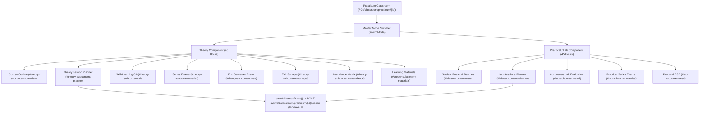
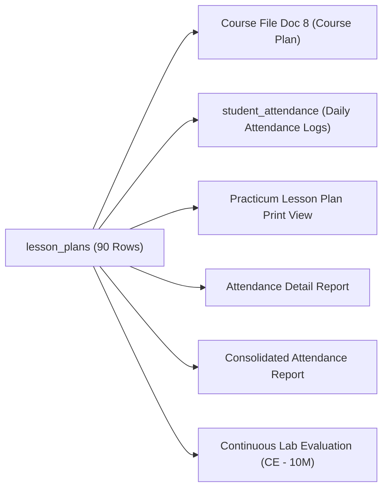

# CampusLynk — R2026 Practicum Lesson Planner Forensic Audit

**Phase:** 2E.2C.2A — R2026 Practicum Lesson Planner Forensic Audit  
**Scope:** R2026 Practicum Virtual Classroom (`resources/views/r26_practicum/virtual_classroom_practicum.blade.php`)  
**Curriculum Standard:** Revision 2026 (R2026) 90-Hour Practicum Delivery Model (45 Theory + 45 Practical Hours)  
**Status:** **READ-ONLY AUDIT COMPLETE — ZERO PRODUCTION CODE MODIFIED**  
**Date:** August 23, 2026  
**Auditor:** Antigravity AI Pair Programmer & Academic Engine Inspector  

---

## 1. Executive Summary

A comprehensive, read-only forensic audit was conducted on the **R2026 Practicum Lesson Planner** workspace across frontend Blade templates, JavaScript execution layers, controller endpoints, database schemas, attendance systems, and print generation pipelines.

The R2026 Practicum subject modality implements a unique **90-Hour Combined Curriculum Framework**:
- **45 Hours Theory Component (L / ST):** Delivered as discrete 1-hour lectures and series test periods covering theoretical foundations and syllabus modules.
- **45 Hours Practical / Lab Component (P / SP):** Delivered as **15 scheduled 3-hour lab sessions** (13 core practical sessions + 2 practical series tests), mapped directly to 45 underlying 1-hour `lesson_plans` database records chunked in 3-hour blocks (`$labPlans->chunk(3)`).

### Core Architectural Findings:
1. **Dual-Workspace Architecture:** The Practicum classroom UI is divided into two distinct workspaces toggled via `switchMode('theory')` and `switchMode('lab')`. Each workspace has its own dedicated planner subtab (`#theory-subcontent-planner` and `#lab-subcontent-planner`).
2. **Unified Persistence Contract:** Despite existing in two separate DOM subtabs, saving is orchestrated through a single unified handler `saveAllLessonPlans()`. This function scans all rows matching `tr[id^="lp-row-"]` across both Theory (1-hour discrete rows) and Lab (3-hour chunked rows with `data-block-ids`), serializing all 90 hours in a single payload to `POST /api/r26/classroom/practicum/{subjectId}/lesson-plan/save-all`.
3. **Chunked Block Synchronization:** In Lab mode, each visible table row corresponds to a 3-hour session block. When saved, the client script explodes `data-block-ids="101,102,103"` and updates all 3 underlying 1-hour database records simultaneously with the same topic, date, pedagogy, and sub-batch.
4. **Attendance Integration:** The `lesson_plans` table is directly coupled with `student_attendance` logs and attendance report generators (`printAttendanceReport` and `printConsolidatedAttendanceReport`), where attendance periods are grouped and verified against `lesson_plan_id`.
5. **Print System Dependencies:** The official A4 print template (`r26_practicum/lesson_plan_print.blade.php`) renders all 90 hours sequentially and dynamically calculates 3-hour vs 1-hour badge labels based on `mode` (`P`/`SP` vs `L`/`ST`).

---

## 2. Files Audited

### 2.1 Primary Blade Template
- [`resources/views/r26_practicum/virtual_classroom_practicum.blade.php`](file:///d:/AMs/academic-platform/carmel-linx-laravel/resources/views/r26_practicum/virtual_classroom_practicum.blade.php) (4,773 lines)
  - **Theory Planner:** Lines 548–642 (`#theory-subcontent-planner`)
  - **Lab Planner:** Lines 1298–1392 (`#lab-subcontent-planner`)
  - **Mode & Subtab Switching Scripts:** Lines 1886–1921 (`switchMode`, `switchTheorySubtab`, `switchLabSubtab`)
  - **Planner Persistence & Dynamic Handlers:** Lines 2316–2415 (`saveAllLessonPlans`, `onPedagogyChange`)

### 2.2 Controllers
- [`app/Http/Controllers/R26VirtualClassroomPracticumController.php`](file:///d:/AMs/academic-platform/carmel-linx-laravel/app/Http/Controllers/R26VirtualClassroomPracticumController.php) (2,486 lines)
  - `show($subjectId)`: Initializes classroom, queries 90-hour plan, triggers self-healing reset for unlogged classes.
  - `generate90HourLessonPlan($batchSubject, $practicumCourseFile)`: Generates 45 Theory (L) + 45 Practical (P) records from syllabus modules and experiments.
  - `saveLessonPlanRow(Request $request, $subjectId)`: Updates single plan row.
  - `saveAllLessonPlans(Request $request, $subjectId)`: Bulk updates all 90 plan records.
  - `printLessonPlanPdf($subjectId)`: Fetches metadata and renders print view.
  - `printAttendanceReport($subjectId)`: Generates period-by-period attendance matrix grouped by `lesson_plan_id`.
  - `printConsolidatedAttendanceReport($subjectId)`: Computes Theory vs Lab present hours and percentages.

### 2.3 Models & Database Tables
- [`app/Models/LessonPlan.php`](file:///d:/AMs/academic-platform/carmel-linx-laravel/app/Models/LessonPlan.php) $\rightarrow$ `lesson_plans` table (17 columns).
- [`app/Models/R26PracticumCourseFile.php`](file:///d:/AMs/academic-platform/carmel-linx-laravel/app/Models/R26PracticumCourseFile.php) $\rightarrow$ `r26_practicum_course_files` table.
- [`app/Models/BatchSubject.php`](file:///d:/AMs/academic-platform/carmel-linx-laravel/app/Models/BatchSubject.php) $\rightarrow$ `batch_subjects` table.
- `student_attendance` table $\rightarrow$ Attendance logs linked via `lesson_plan_id`.

### 2.4 Print & Report Views
- [`resources/views/r26_practicum/lesson_plan_print.blade.php`](file:///d:/AMs/academic-platform/carmel-linx-laravel/resources/views/r26_practicum/lesson_plan_print.blade.php) (121 lines)
- [`resources/views/r26_practicum/attendance_report_print.blade.php`](file:///d:/AMs/academic-platform/carmel-linx-laravel/resources/views/r26_practicum/attendance_report_print.blade.php)
- [`resources/views/r26_practicum/attendance_consolidated_print.blade.php`](file:///d:/AMs/academic-platform/carmel-linx-laravel/resources/views/r26_practicum/attendance_consolidated_print.blade.php)
- [`resources/views/r26_practicum/course_file_pdf.blade.php`](file:///d:/AMs/academic-platform/carmel-linx-laravel/resources/views/r26_practicum/course_file_pdf.blade.php)
- [`resources/views/course_files/preview_doc_8.blade.php`](file:///d:/AMs/academic-platform/carmel-linx-laravel/resources/views/course_files/preview_doc_8.blade.php)

---

## 3. Practicum Information Architecture



### User Journey & Navigation Flow:
1. **Course Entry:** User accesses `/r26/classroom/practicum/{subjectId}`.
2. **Mode Selection:** User toggles between **Theory Mode** (`#mode-theory-container`) and **Lab Mode** (`#mode-lab-container`) using top navigation buttons.
3. **Planner Subtab Navigation:**
   - In Theory Mode, user selects the **Planner** subtab (`switchTheorySubtab('planner')`), rendering `#theory-subcontent-planner`.
   - In Lab Mode, user selects the **Lab Planner** subtab (`switchLabSubtab('planner')`), rendering `#lab-subcontent-planner`.
4. **Session Editing:**
   - **Theory Rows:** Faculty edits proposed/actual dates, topic content, pedagogy, taxonomy, remarks for 45 individual 1-hour sessions.
   - **Lab Rows:** Faculty edits 15 3-hour session blocks, assigning sub-batch (`Batch A & B (Combined)`, `Batch A`, `Batch B`) and session pedagogy (`Practical Lab (P)`, `Practical Series Exam (SP)`).
5. **Persistence Execution:** Faculty clicks **"Save All 90 Hours"** (or **"Save Changes"**) in either toolbar. `saveAllLessonPlans()` gathers all rows across both tables and sends a single synchronized payload.
6. **Print Review:** Faculty clicks **"Print Lesson Plan"** (`/r26/classroom/practicum/{id}/print-lesson-plan`) to verify the formatted 90-hour A4 document.

---

## 4. Theory vs Lab Forensic Comparison

| Feature / Dimension | 45-Hour Theory Planning | 45-Hour Practical / Lab Planning | Shared / Unified Contract |
| :--- | :--- | :--- | :--- |
| **DOM Container** | `#theory-subcontent-planner` | `#lab-subcontent-planner` | Both reside in `virtual_classroom_practicum.blade.php` |
| **Query Filter** | `$lessonPlans->whereIn('mode', ['L', 'ST'])->take(45)` | `$lessonPlans->whereIn('mode', ['P', 'SP'])->values()->take(45)` | Sourced from same `$lessonPlans` collection |
| **Granularity** | **45 Individual 1-Hour Rows** | **15 Chunked 3-Hour Session Blocks** (`$labPlans->chunk(3)`) | Total: 90 contact hours |
| **Table Row ID** | `id="lp-row-{{ $plan->id }}"` | `id="lp-row-{{ $firstPlan->id }}"` | Both start with `lp-row-` |
| **Row Attributes** | `data-plan-id="{{ $plan->id }}"` | `data-plan-id="{{ $firstPlan->id }}" data-block-ids="{{ $blockIds }}"` | Read by `saveAllLessonPlans()` |
| **Topic Text** | Full topic string | Stripped session title: `preg_replace('/\s*\(Hour \d+\/\d+\)/i', '', ...)` | Auto-expanded on generation |
| **Pedagogy Options** | `Lecture (L)`, `Theory Series Exam (ST)`, `PPT Presentation`, `Demonstration`, `Group Activity` | `Practical Lab (P)`, `Practical Series Exam (SP)`, `Demonstration`, `Group Activity` | Dropdown handles dynamic styling |
| **Sub-Batch Control** | Hidden input `value="All Students"` | Dropdown: `Batch A & B (Combined)`, `Batch A`, `Batch B` | Saved to `sub_batch` column |
| **Hours Display** | Solid `1 Hour` badge | Solid `3 Hours` badge | Dynamic toggle via `onPedagogyChange()` |
| **Save API** | `saveAllLessonPlans()` | `saveAllLessonPlans()` | Shared `POST /api/r26/classroom/practicum/{id}/lesson-plan/save-all` |
| **Print Output** | Sequential rows with `1 Hour` badge | Sequential rows with `3 Hours` badge | Shared A4 template `r26_practicum/lesson_plan_print` |

---

## 5. DOM Contract Preservation Matrix

Every single DOM element listed below is an active functional contract that **MUST NOT** be renamed or removed during UI modernization.

| Element Selector / ID | Tag | Purpose / Functional Role | Dependent Function / API | Migration Requirement |
| :--- | :--- | :--- | :--- | :--- |
| `#mode-theory-container` | `div` | Theory mode outer container | `switchMode('theory')` | **STRICTLY PRESERVE** |
| `#mode-lab-container` | `div` | Lab mode outer container | `switchMode('lab')` | **STRICTLY PRESERVE** |
| `#theory-subcontent-planner` | `div` | Theory planner subtab container | `switchTheorySubtab('planner')` | **STRICTLY PRESERVE** |
| `#lab-subcontent-planner` | `div` | Lab planner subtab container | `switchLabSubtab('planner')` | **STRICTLY PRESERVE** |
| `tr[id^="lp-row-"]` | `tr` | Planner table row selector | `saveAllLessonPlans()` selector | **STRICTLY PRESERVE** |
| `[data-plan-id]` | attr | Primary `lesson_plans.id` binding | `saveAllLessonPlans()` | **STRICTLY PRESERVE** |
| `[data-block-ids]` | attr | Comma-separated 3-hour IDs | `saveAllLessonPlans()` multi-row expansion | **STRICTLY PRESERVE** |
| `#lp-pedagogy-{id}` | `select` | Session pedagogy dropdown | `saveAllLessonPlans()`, `onPedagogyChange()` | **STRICTLY PRESERVE** |
| `#lp-prop-{id}` | `input[date]` | Proposed delivery date | `saveAllLessonPlans()` | **STRICTLY PRESERVE** |
| `#lp-act-{id}` | `input[date]` | Actual conducted date | `saveAllLessonPlans()` | **STRICTLY PRESERVE** |
| `#lp-topic-{id}` | `textarea` | Session topic / description | `saveAllLessonPlans()` | **STRICTLY PRESERVE** |
| `#lp-co-{id}` | `input[hidden]` | CO ID binding (e.g. `CO1`) | `saveAllLessonPlans()` | **STRICTLY PRESERVE** |
| `#lp-batch-{id}` | `select/hidden`| Sub-batch assignment | `saveAllLessonPlans()`, `onPedagogyChange()` | **STRICTLY PRESERVE** |
| `#lp-batch-td-{id}` | `td` | Container for batch control | `onPedagogyChange()` DOM replacement | **STRICTLY PRESERVE** |
| `#lp-hours-td-{id}` | `td` | Container for hours badge | `onPedagogyChange()` DOM replacement | **STRICTLY PRESERVE** |
| `#lp-remarks-{id}` | `input[text]` | Session remarks & status | `saveAllLessonPlans()` | **STRICTLY PRESERVE** |
| `#theory-tab-planner` | `button` | Subtab button for Theory planner | `switchTheorySubtab()` | **STRICTLY PRESERVE** |
| `#lab-tab-planner` | `button` | Subtab button for Lab planner | `switchLabSubtab()` | **STRICTLY PRESERVE** |

---

## 6. JavaScript Forensic Audit

### 6.1 `saveAllLessonPlans()`
- **Location:** `resources/views/r26_practicum/virtual_classroom_practicum.blade.php` (Lines 2316–2375)
- **Trigger:** Click on "Save All 90 Hours" or "Save Changes" button.
- **Workflow:**
  1. Selects all rows matching `document.querySelectorAll('tr[id^="lp-row-"]')`.
  2. Extracts `planId` from `data-plan-id`.
  3. Checks for `data-block-ids`. If present (Lab block), splits into array `['101', '102', '103']`; otherwise `[planId]`.
  4. Reads values from `#lp-pedagogy-{id}`, `#lp-prop-{id}`, `#lp-act-{id}`, `#lp-topic-{id}`, `#lp-co-{id}`, `#lp-batch-{id}`, `#lp-remarks-{id}`.
  5. Pushes an object for each target ID into `plans` array.
  6. Dispatches `fetch('/api/r26/classroom/practicum/{subjectId}/lesson-plan/save-all', { method: 'POST', body: JSON.stringify({ plans }) })`.
  7. Shows Swal alert on response.
- **Side Effects:** Updates all 90 records in `lesson_plans` table simultaneously.

### 6.2 `onPedagogyChange(planId, val)`
- **Location:** Lines 2377–2414
- **Trigger:** `onchange` on `#lp-pedagogy-{planId}`.
- **Logic:**
  1. Determines if `val` is a practical/lab mode (`isLab = val.includes('Practical') || val.includes('Lab') || ...`).
  2. Updates pedagogy text color (emerald for Lab, purple for Series, blue for Lecture).
  3. If `isLab`, updates `#lp-hours-td-{planId}` to `3 Hours` badge and renders `#lp-batch-{planId}` `<select>` with `Batch A & B`, `Batch A`, `Batch B`.
  4. If Theory, updates `#lp-hours-td-{planId}` to `1 Hour` badge and renders `#lp-batch-{planId}` hidden input with value `"All Students"`.

### 6.3 Subtab & Mode Switching Handlers
- `switchMode(mode)`: Toggles `#mode-theory-container` vs `#mode-lab-container` and saves active state to `localStorage.getItem('active_mode')`.
- `switchTheorySubtab(tab)`: Hides all `#theory-subcontent-*` and un-hides `#theory-subcontent-${tab}`.
- `switchLabSubtab(tab)`: Hides all `#lab-subcontent-*` and un-hides `#lab-subcontent-${tab}`.

---

## 7. Backend & API Contract Audit

| Endpoint URI | Method | Controller & Action | Payload Contract | Response Contract | Downstream Impact |
| :--- | :--- | :--- | :--- | :--- | :--- |
| `r26/classroom/practicum/{subjectId}` | `GET` | `R26VirtualClassroomPracticumController@show` | None (URL parameter `subjectId`) | Renders `virtual_classroom_practicum.blade.php` | Main classroom view |
| `api/r26/classroom/practicum/{subjectId}/lesson-plan/save-all` | `POST` | `R26VirtualClassroomPracticumController@saveAllLessonPlans` | `{ plans: [ { id, pedagogy, proposed_date, actual_date, topic_content, co_id, sub_batch, remarks } ] }` | `{ status: 'SUCCESS'\|'ERROR', message: string }` | Updates all 90 rows in `lesson_plans` |
| `api/r26/classroom/practicum/{subjectId}/lesson-plan/save` | `POST` | `R26VirtualClassroomPracticumController@saveLessonPlanRow` | `{ plan_id, topic_content, proposed_date, actual_date, co_id, sub_batch, mode, remarks, status }` | `{ status: 'SUCCESS'\|'ERROR', message: string }` | Single row updater |
| `r26/classroom/practicum/{subjectId}/print-lesson-plan` | `GET` | `R26VirtualClassroomPracticumController@printLessonPlanPdf` | None (URL parameter `subjectId`) | Renders `r26_practicum/lesson_plan_print.blade.php` | Official A4 print generation |
| `r26/classroom/practicum/{subjectId}/attendance-report` | `GET` | `R26VirtualClassroomPracticumController@printAttendanceReport` | None | Renders `r26_practicum/attendance_report_print.blade.php` | Queries `lesson_plans` for attendance grid |
| `r26/classroom/practicum/{subjectId}/attendance-consolidated` | `GET` | `R26VirtualClassroomPracticumController@printConsolidatedAttendanceReport` | None | Renders `r26_practicum/attendance_consolidated_print.blade.php` | Splits Theory vs Lab attendance totals |

---

## 8. Data Model & Storage Audit

### `lesson_plans` Database Schema (17 Columns):

```sql
CREATE TABLE `lesson_plans` (
  `id` bigint unsigned NOT NULL AUTO_INCREMENT,
  `batch_subject_id` bigint unsigned NOT NULL,
  `day_no` int NOT NULL,
  `co_id` varchar(20) DEFAULT NULL,
  `topic_content` text NOT NULL,
  `allocated_hours` int DEFAULT '1',
  `proposed_date` date DEFAULT NULL,
  `actual_date` date DEFAULT NULL,
  `actual_hours` int DEFAULT NULL,
  `pedagogy` varchar(100) DEFAULT NULL,
  `mode` varchar(50) DEFAULT 'L',
  `sub_batch` varchar(50) DEFAULT 'ALL',
  `taxonomy` varchar(100) DEFAULT NULL,
  `remarks` text,
  `status` enum('Pending','Completed') DEFAULT 'Pending',
  `created_at` timestamp NULL DEFAULT NULL,
  `updated_at` timestamp NULL DEFAULT NULL,
  PRIMARY KEY (`id`),
  KEY `batch_subject_id_idx` (`batch_subject_id`)
) ENGINE=InnoDB DEFAULT CHARSET=utf8mb4;
```

### Practicum Data Distribution:
For a 90-hour Practicum subject (e.g. `ME-1021 Basic Mechanical Engineering` or `EL-1041 Elementary Concepts of Electronics`):
- **Rows 1 to 45:** Theory component (`mode = 'L'` or `'ST'`).
  - `allocated_hours = 1`, `sub_batch = 'ALL'` (or `'All Students'`).
- **Rows 46 to 90:** Practical component (`mode = 'P'` or `'SP'`).
  - `allocated_hours = 1` (stored individually per hour, chunked into 3-hour blocks in the UI), `sub_batch = 'Batch A & B'` / `'Batch A'` / `'Batch B'`.

---

## 9. Business Logic & Calculation Audit

1. **Total Curriculum Hours:**
   $$\text{Total Practicum Hours} = \text{Theory Hours (45)} + \text{Practical Hours (45)} = 90 \text{ Contact Hours}$$
2. **Theory Contact Hours Breakdown:**
   $$\text{Theory Allocation} = 41 \text{ Lecture Hours } (L) + 4 \text{ Series Exam Hours } (ST) = 45 \text{ Hours}$$
3. **Lab Contact Hours Breakdown:**
   $$\text{Lab Allocation} = (13 \text{ Lab Sessions} \times 3 \text{ Hours } (P)) + (2 \text{ Series Practical Exams} \times 3 \text{ Hours } (SP)) = 45 \text{ Hours}$$
4. **Completion Logic:**
   In `saveAllLessonPlans()`, `status` is calculated based on `actual_date`:
   $$\text{status} = \begin{cases} \text{'Completed'}, & \text{if } \text{actual\_date is not null} \\ \text{'Pending'}, & \text{if } \text{actual\_date is null} \end{cases}$$
5. **Coverage Metrics Calculation:**
   $$\text{Theory Coverage \%} = \frac{\text{Theory Completed Hours}}{\text{45}} \times 100\%$$
   $$\text{Lab Coverage \%} = \frac{\text{Lab Completed Hours}}{\text{45}} \times 100\%$$
   $$\text{Combined Practicum Coverage \%} = \frac{\text{Total Completed Hours}}{\text{90}} \times 100\%$$

---

## 10. Print & Report Dependencies

1. **`r26_practicum/lesson_plan_print.blade.php`:**
   - Consumes `$lessonPlans` directly.
   - Iterates through all 90 rows sequentially.
   - Renders `Day / Hr`, `Pedagogy`, `Proposed Date`, `Actual Date`, `Topic & Content Description`, `CO`, `Sub-Batch`, `Hours Needed`, and `Remarks`.
   - Displays `3 Hours` for `P`/`SP` and `1 Hour` for `L`/`ST`.
2. **`r26_practicum/attendance_report_print.blade.php`:**
   - Queries `$theoryPlans` and `$labPlans` to construct student attendance matrix with checkmarks.
3. **`r26_practicum/attendance_consolidated_print.blade.php`:**
   - Computes total Theory hours attended vs Lab hours attended per student.
4. **`course_files/preview_doc_8.blade.php`:**
   - Renders Document 8 ("Course Plan") in the master course file.

---

## 11. Shared System Dependencies



---

## 12. Mobile Preservation Boundary

- **Mobile View File:** `resources/views/staff_mobile_dashboard.blade.php`
- **Mobile Routes:** `/mobile/*`, `/staff/mobile/*`
- **Policy:** The Practicum desktop UI modernization in Phase 2E.2C.2 must **NEVER** edit, alter, or touch mobile views or mobile APIs. Mobile views use a separate compact card list layout and are completely isolated from desktop Blade refactoring.

---

## 13. Current UI/UX Problems in Legacy Practicum Planner

1. **Legacy Dark Glass Styling:** Uses dark `#0f172a` glass cards with high contrast glare, dark borders, and inconsistent visual themes compared to the modernized CampusLynk white-card system.
2. **Missing Metric Summaries:** Neither the Theory planner nor the Lab planner provides high-level metric cards (Planned Hours, Completed Hours, Remaining Hours, Coverage %).
3. **No Filtering or Search:** In a 45-row Theory table and 15-row Lab table, there is no real-time search, CO filter, or status filter to locate specific topics or pending sessions quickly.
4. **Manual Height Resizing JavaScript:** Textareas use inline `oninput="this.style.height = ''; this.style.height = this.scrollHeight + 'px'"` which causes layout jumps.
5. **Lack of Inline Visual Status Badges:** Status is represented only as an editable remarks input, without clear emerald/amber delivery indicators.
6. **Disjointed Save Workspaces:** Both subtabs feature a "Save All 90 Hours" button, but visual feedback is minimal (uses generic Swal popup).

---

## 14. CampusLynk Redesign Opportunities

Without altering backend logic or API payloads, the Practicum Planner can be elevated into a state-of-the-art academic workspace:

### A. Dual Metric Summary Bars
- **Theory Planner Header:** 4 metric cards:
  1. Theory Planned Hours (`45 Hrs`)
  2. Theory Completed Hours (`X Hrs`)
  3. Theory Remaining Hours (`Y Hrs`)
  4. Theory Coverage % (with progress bar)
- **Lab Planner Header:** 4 metric cards:
  1. Lab Planned Hours (`45 Hrs / 15 Sessions`)
  2. Lab Conducted Hours (`X Hrs / N Sessions`)
  3. Lab Remaining Hours (`Y Hrs / M Sessions`)
  4. Lab Coverage % (with progress bar)

### B. Action & Filter Toolbars
- Modernized toolbar with Lucide icons:
  - **Print Plan** (`/r26/classroom/practicum/{id}/print-lesson-plan`)
  - **Save All 90 Hours** (`saveAllLessonPlans()`)
- Real-time client-side search box (`#theoryPlannerSearch`, `#labPlannerSearch`)
- CO Tag filter dropdown (`All COs`, `CO1`–`CO4`)
- Sub-Batch filter in Lab mode (`All Batches`, `Combined`, `Batch A`, `Batch B`)
- Dynamic session counter (`Showing X of Y sessions`)

### C. Clean White-Card Tables
- Solid white cards (`bg-white border border-slate-200/80 rounded-2xl shadow-xs`)
- Sticky headers with crisp solid slate typography (minimum 14px `text-sm`)
- Solid high-contrast CO badges (`CO1` emerald, `CO2` blue, `CO3` purple, `CO4` amber)
- Solid delivery status pills (emerald for Conducted, amber for Pending)

---

## 15. Comparison with Phase 2E.2C.1 (Theory Classroom)

| Dimension | Phase 2E.2C.1 (R2026 Theory) | Phase 2E.2C.2 (R2026 Practicum) |
| :--- | :--- | :--- |
| **Total Hours** | Variable (60–62 hours standard) | **Strict 90 Hours (45 Theory + 45 Lab)** |
| **Structure** | Single `#tab-planner` table | **Dual subtabs:** `#theory-subcontent-planner` & `#lab-subcontent-planner` |
| **Lab Chunking** | N/A (Pure Theory) | **3-Hour Session Chunking** with `data-block-ids` |
| **Sub-Batching** | N/A | **Dynamic Sub-Batch Dropdown** (`Batch A & B`, `Batch A`, `Batch B`) |
| **Save API** | `POST /api/r26/classroom/{id}/lesson-plans/bulk-update` | `POST /api/r26/classroom/practicum/{id}/lesson-plan/save-all` |
| **Shared Design Language** | Metric bar, white cards, minimum 14px typography, solid CO badges, sticky header, client-side filtering | **Same visual language, tailored to Practicum dual-workspace** |

---

## 16. Absolute Do-Not-Modify Contract

### STRICTLY PROHIBITED ACTIONS:
- ❌ **DO NOT** modify `lesson_plans` database table structure or column names.
- ❌ **DO NOT** alter `R26VirtualClassroomPracticumController.php` method signatures or API payloads.
- ❌ **DO NOT** change `POST /api/r26/classroom/practicum/{subjectId}/lesson-plan/save-all` contract.
- ❌ **DO NOT** rename or remove DOM IDs: `#theory-subcontent-planner`, `#lab-subcontent-planner`, `tr[id^="lp-row-"]`, `lp-pedagogy-*`, `lp-prop-*`, `lp-act-*`, `lp-topic-*`, `lp-co-*`, `lp-batch-*`, `lp-remarks-*`.
- ❌ **DO NOT** remove data attributes: `data-plan-id`, `data-block-ids`.
- ❌ **DO NOT** rename JavaScript functions: `saveAllLessonPlans()`, `onPedagogyChange()`, `switchMode()`, `switchTheorySubtab()`, `switchLabSubtab()`.
- ❌ **DO NOT** modify print view `r26_practicum/lesson_plan_print.blade.php`.
- ❌ **DO NOT** modify mobile view `staff_mobile_dashboard.blade.php`.

---

## 17. Migration Risk Matrix

| Component | Risk Level | Reason | Preservation Strategy |
| :--- | :--- | :--- | :--- |
| **Lab 3-Hour Block IDs** | **CRITICAL** | `saveAllLessonPlans()` relies on `data-block-ids` to update 3 rows per session block | Keep `data-block-ids="{{ $blockIds }}"` exactly intact on every lab row |
| **Unified 90-Hour Payload** | **HIGH** | `saveAllLessonPlans()` gathers rows from both Theory and Lab tables across hidden tabs | Maintain standard `tr[id^="lp-row-"]` prefix and element ID conventions |
| **Dynamic Pedagogy Switcher** | **HIGH** | `onPedagogyChange()` dynamically injects batch dropdowns and hour badges | Ensure replacement HTML maintains `#lp-batch-{id}` and `#lp-hours-td-{id}` IDs |
| **Attendance Linkage** | **MEDIUM** | Attendance reports group records by `lesson_plan_id` | Keep all 90 underlying `lesson_plans.id` bindings stable |
| **Print Output Consistency** | **MEDIUM** | A4 print layout requires exact field compatibility | Test `/r26/classroom/practicum/{id}/print-lesson-plan` after UI changes |
| **Client-Side Filtering** | **LOW** | Filtering could hide rows during save if not properly scoped | `saveAllLessonPlans()` queries DOM elements regardless of CSS `hidden` class |

---

## 18. Recommended Implementation Plan

When approval is granted to proceed with Phase 2E.2C.2 implementation, execute the following subphases:

1. **Subphase 2E.2C.2-1 — Theory Planner Workspace Modernization:**
   - Modernize `#theory-subcontent-planner` in `virtual_classroom_practicum.blade.php`.
   - Add 4-card Theory Metric Summary Bar (45h planned, completed, remaining, coverage %).
   - Add search and CO filter controls.
   - Upgrade table to white card with minimum 14px typography and solid CO badges.
2. **Subphase 2E.2C.2-2 — Lab Planner Workspace Modernization:**
   - Modernize `#lab-subcontent-planner` in `virtual_classroom_practicum.blade.php`.
   - Add 4-card Lab Metric Summary Bar (45h / 15 sessions planned, conducted, remaining, coverage %).
   - Add search, CO, and sub-batch filter controls.
   - Upgrade 3-hour chunked table to white card layout while strictly preserving `data-block-ids`.
3. **Subphase 2E.2C.2-3 — Action Toolbar & Persistence Polish:**
   - Refine "Save All 90 Hours" button with loading spinners and status indicators.
   - Update `onPedagogyChange()` to use modern CampusLynk badge classes.
4. **Subphase 2E.2C.2-4 — Regression Verification & Deliverable Report:**
   - Compile assets with `npm run build`.
   - Test route `/r26/classroom/practicum/3` for HTTP 200 and all DOM contract assertions.
   - Generate `migration/PHASE_2E_2C_2_PRACTICUM_LESSON_PLANNER_MIGRATION_REPORT.md`.

---

## 19. Verification Plan

The verification suite will assert:
1. `GET /r26/classroom/practicum/3` returns `HTTP 200`.
2. Rendered HTML contains `#theory-subcontent-planner` and `#lab-subcontent-planner`.
3. Rendered HTML contains all 45 Theory `tr[id^="lp-row-"]` rows and all 15 Lab chunked `tr[id^="lp-row-"]` rows with `data-block-ids`.
4. Rendered HTML contains all field IDs: `lp-pedagogy-*`, `lp-prop-*`, `lp-act-*`, `lp-topic-*`, `lp-co-*`, `lp-batch-*`, `lp-remarks-*`.
5. JavaScript functions `saveAllLessonPlans()`, `onPedagogyChange()`, `switchMode()`, `switchTheorySubtab()`, `switchLabSubtab()` exist and function.
6. Print route `/r26/classroom/practicum/3/print-lesson-plan` returns `HTTP 200`.
7. `npm run build` completes with 0 errors.

---

## 20. Final Audit Conclusion

The forensic audit of the **R2026 Practicum Lesson Planner** is complete. All structural contracts, data structures, chunking mechanisms, and persistence endpoints have been documented.

**PHASE 2E.2C.2A FORENSIC AUDIT COMPLETE — NO PRODUCTION FILES MODIFIED.**
