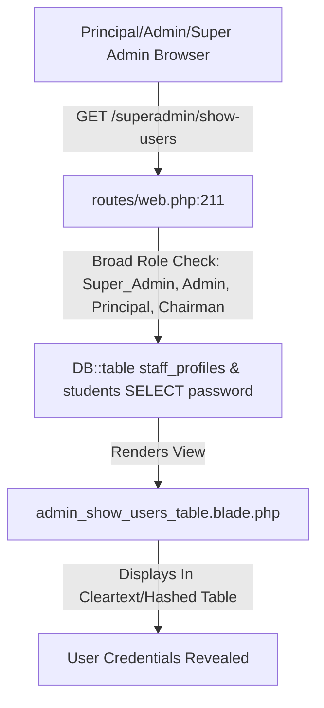

# CampusLynk — Administrative Role Separation & UI Authorization Forensic Audit
**Document ID:** `CAMPUSLYNK-AUDIT-2026-AUTH-01`  
**Audit Type:** Read-Only Forensic Architecture & Security Analysis  
**Audit Scope:** Super Admin vs. Admin vs. Principal Access Control, UI Exposure, Routes, APIs, Mutations & Data Exposure  
**Date:** August 23, 2026  
**Status:** COMPLETE (READ-ONLY AUDIT — ZERO SOURCE CODE MODIFICATIONS PERFORMED)

---

## 1. Executive Summary

A comprehensive, read-only forensic audit was conducted across the CampusLynk Laravel application to analyze administrative role separation, UI authorization, route security, and data exposure among **Super Admin**, **Admin**, and **Principal** roles.

### Key Audit Findings:
1. **Critical Privilege Conflation Between Principal & Admin:**  
   The Principal user currently receives full Admin-level UI controls and backend access. The route `/dashboard/principal` loads `admin_control_desk.blade.php`, which hardcodes `<x-layout.sidebar role="admin" />`. Consequently, the Principal dashboard renders the Admin navigation tree, exposing **User Credentials (`/superadmin/show-users`)**, **Drive Backups**, **Audit Trail**, and **System Settings**.
2. **Critical Exposure in User Credentials (`/superadmin/show-users`):**  
   The route `/superadmin/show-users` explicitly permits `Principal`, `Chairman`, `Admin`, and `Super_Admin`. In doing so, it queries `password` fields from both `staff_profiles` and `students` tables and renders credential records directly into the view `admin_show_users_table.blade.php`.
3. **Server-Side Authorization Deficit in Sensitive Admin APIs:**  
   Administrative mutation endpoints (including `/api/admin/users/reset-password`, `/api/admin/user/change-role`, `/api/admin/user/delete`, `/api/admin/users/status`, `/api/admin/settings`, and `/api/system/backup`) are declared in `routes/web.php` without role middleware or server-side role validation. Any authenticated session can invoke these endpoints directly.
4. **Audit Log Actor Misattribution:**  
   Administrative closures in `routes/web.php` default the actor attribution to `'performed_by_name' => Session::get('userName', 'Principal')` and `'performed_by' => Session::get('userId', 'ADMIN-001')`, conflating administrative accountability with the Principal.

---

## 2. Role Architecture

### 2.1 Database Role Representation
CampusLynk does not utilize a dedicated `roles` or `permissions` RBAC relational schema (e.g., Spatie Laravel Permission). Roles are stored across two tables:
* **`staff_profiles` Table:** Contains column `designation` (VARCHAR).
  * Distinct designations in database: `Admin`, `Principal`, `HOD`, `Tutor`, `Lecturer`, `Professor`, `Demonstrator`, `Trade Instructor`, `Workshop Superintendent`.
  * The column `role` does not exist as a separate enum; role identity is derived from `designation`.
* **`students` Table:** Contains `status`, `reg_no`, `adm_no`. Identified implicitly as `role => 'Student'`.

### 2.2 Session-Based Authorization State
Authentication is managed in `App\Http\Controllers\AuthController::login()`:
* **Staff Login:** Queries `staff_profiles` by `mobile_no` and verifies password.
* **Role Assignment in Session:**
  * If `designation === 'Admin'` $\rightarrow$ `Session::put('userRole', 'Admin')` $\rightarrow$ redirects to `/dashboard/admin`.
  * If `designation === 'Principal'` $\rightarrow$ `Session::put('userRole', 'Principal')` $\rightarrow$ redirects to `/dashboard/principal`.
  * If `designation === 'Super Admin'` / `'Super_Admin'` $\rightarrow$ `Session::put('userRole', 'Super_Admin')` $\rightarrow$ redirects to `/dashboard/superadmin`.
  * If designation starts with `'HOD'` $\rightarrow$ `Session::put('userRole', 'HOD')` $\rightarrow$ redirects to `/dashboard/hod`.
  * If designation contains `'Tutor'` $\rightarrow$ `Session::put('userRole', 'Tutor')` $\rightarrow$ redirects to `/dashboard/tutor`.
  * Otherwise $\rightarrow$ `Session::put('userRole', 'Lecturer')` $\rightarrow$ redirects to `/dashboard/lecturer`.

### 2.3 Global Middleware Pipeline
* In `bootstrap/app.php`, the middleware pipeline configures CSRF exclusions for `/login` and `/api/*`.
* There are **no role-enforcing middleware classes** registered in `bootstrap/app.php` (such as `role:admin`, `role:super_admin`, or `role:principal`).
* Authorization is evaluated through procedural `Session::get('userRole')` checks inside route closures or controller methods.

---

## 3. Super Admin Definition

### 3.1 Architectural Status
In CampusLynk, **Super Admin** is represented as:
* An elevated designation string (`Super_Admin` or `SuperAdmin`) in session state.
* The configuration `config/navigation/super_admin.php` defines:
  ```php
  'role' => 'super_admin',
  'inherits' => 'admin',
  'subtitle' => 'Super Admin Console',
  'items' => [
      ['id' => 'user_credentials', 'label' => 'User Credentials', 'icon' => 'key', 'url' => '/superadmin/show-users']
  ]
  ```
* **Intended Scope:** Exclusive authority over credential inspection, developer/system logs, master database restoration, and server-level configuration.
* **Current Operational Overlap:** `admin_control_desk.blade.php` is shared across Super Admin and Principal without dynamic feature bifurcation.

---

## 4. Admin Definition

### 4.1 Architectural Status
**Admin** represents the institutional system administrator responsible for daily operational maintenance:
* Master data onboarding and batch uploads.
* Staff and student profile activation/deactivation.
* System settings (AI generator keys, geofence parameters).
* Institutional timetable synchronization and log aggregation.
* **Intended Boundary:** System Administration (non-academic policy).

---

## 5. Principal Definition

### 5.1 Architectural Status
**Principal** represents the executive academic and institutional head:
* Institutional KPI monitoring and compliance oversight.
* Department supervision (HOD overview, pass percentages, NBA/SBTE compliance).
* Executive flash notices and institutional calendar events.
* Staff leave approvals and master leave ledger review.
* SF staff attendance inspection.
* **Intended Boundary:** Institutional Governance & Academic Supervision (NOT User Credential / Password Management or System Database Restorations).

---

## 6. Navigation Audit

| Navigation Item | ID | `admin.php` | `super_admin.php` | `principal.php` | Rendered on Principal UI (`admin_control_desk`) | Expected Role | Status |
| :--- | :--- | :---: | :---: | :---: | :---: | :---: | :--- |
| **Dashboard Overview** | `dashboard` | Yes | Inherited | Yes | Yes | All Executives | **Correct** |
| **My Batches** | `my_batches` | Yes | Inherited | Yes | Yes | Principal / Faculty | **Correct** |
| **All-Dept Timetables** | `all_timetables` | Yes | Inherited | Yes | Yes | Principal / Admin | **Correct** |
| **User Directory** | `directory` | Yes | Inherited | Yes | Yes | Admin / Principal (Read-Only) | **Overexposed (Mutations active)** |
| **User Credentials** | `user_credentials` | Yes | Added | **No** | **YES (Overexposed)** | **Super Admin Only** | **CRITICAL OVEREXPOSURE** |
| **Drive Backups** | `backups` | Yes | Inherited | Yes | Yes | Super Admin / Admin | **Overexposed to Principal** |
| **Audit Trail** | `audit` | Yes | Inherited | Yes | Yes | Super Admin / Admin | **Overexposed to Principal** |
| **System Settings** | `settings` | Yes | Inherited | Yes | Yes | Super Admin / Admin | **Overexposed to Principal** |
| **Professional Activities** | `prof_activities` | Yes | Inherited | Yes | Yes | Principal / Admin | **Correct** |
| **Master Leave Ledger** | `leave_ledger` | Yes | Inherited | Yes | Yes | Principal / Admin | **Correct** |
| **SF Staff Attendance** | `sf_attendance` | Yes | Inherited | Yes | Yes | Principal / Admin | **Correct** |
| **Executive Profile** | `profile` | Yes | Inherited | Yes | Yes | All | **Correct** |

### Root Cause of Navigation Overexposure:
In `resources/views/admin_control_desk.blade.php` (line 48):
```html
<x-layout.sidebar role="admin" active="dashboard" />
```
The view hardcodes `role="admin"` instead of dynamically passing `role="{{ strtolower(Session::get('userRole', 'admin')) }}"`. Even though a dedicated `config/navigation/principal.php` exists without `user_credentials`, the Principal is served `config/navigation/admin.php`.

---

## 7. Dashboard Component Audit

| Dashboard Component / Panel | ID | Admin Desk | Principal Desk | Super Admin | Current Access Mechanism | Risk Level |
| :--- | :--- | :---: | :---: | :---: | :--- | :---: |
| **Executive KPI Summary** | `panelDashboard` | Active | Active | Active | Open via `admin_control_desk` | Low |
| **All-Dept Master Timetable** | `panelAll_timetables` | Active | Active | Active | Open via `admin_control_desk` | Low |
| **User Directory & Account Action** | `panelDirectory` | Active | Active | Active | Client-side tab toggle | **High** |
| **Drive Backup & Manual Snapshot** | `panelBackups` | Active | Active | Active | Client-side tab toggle | **High** |
| **Audit Log Inspector** | `panelAudit` | Active | Active | Active | Client-side tab toggle | **Medium** |
| **System & AI Settings Panel** | `panelSettings` | Active | Active | Active | Client-side tab toggle | **High** |
| **Staff Professional Activities** | `panelProf_activities`| Active | Active | Active | Client-side tab toggle | Low |
| **Institutional Leave Ledger** | `panelLeave_ledger` | Active | Active | Active | Client-side tab toggle | Low |
| **SF Staff Attendance & Geofence** | `panelSf_attendance` | Active | Active | Active | Client-side tab toggle | **Medium** |
| **User Credentials Table View** | `admin_show_users_table`| Active | Active | Active | Direct link `/superadmin/show-users` | **CRITICAL** |

---

## 8. Route Authorization Audit

| Route URI | HTTP Method | Target Handler | Middleware | Server-Side Role Check | Classification |
| :--- | :--- | :--- | :--- | :--- | :--- |
| `/superadmin/show-users` | `GET` | Closure (`web.php:211`) | `web` | Checks `in_array($role, ['Super_Admin', 'SuperAdmin', 'Principal', 'Admin', 'Chairman'])` | **RED** (Overly broad; exposes credentials to Principal/Chairman) |
| `/superadmin/credentials` | `GET` | Redirect to `/superadmin/show-users` | `web` | None | **RED** |
| `/admin/show-users` | `GET` | Redirect to `/superadmin/show-users` | `web` | None | **RED** |
| `/dashboard/admin` | `GET` | Closure (`web.php:234`) | `web` | Checks `$role === 'Admin'` | **GREEN** |
| `/dashboard/principal` | `GET` | Closure (`web.php:239`) | `web` | Checks `$role === 'Super_Admin' \|\| $role === 'Principal'` | **YELLOW** (Loads Admin Desk) |
| `/dashboard/superadmin` | `GET` | Closure (`web.php:205`) | `web` | Checks `$role === 'Super_Admin' \|\| $role === 'Principal'` | **YELLOW** (Conflates Super Admin with Principal) |
| `/api/admin/users` | `GET` | Closure (`web.php:2107`) | `web` | **NONE** | **RED** |
| `/api/admin/users/status` | `POST` | Closure (`web.php:2208`) | `web` | **NONE** | **RED** |
| `/api/admin/user/toggle-status` | `POST` | Closure (`web.php:2239`) | `web` | **NONE** | **RED** |
| `/api/admin/users/reset-password` | `POST` | Closure (`web.php:2258`) | `web` | **NONE** | **RED** |
| `/api/admin/user/reset-password` | `POST` | Closure (`web.php:2280`) | `web` | **NONE** | **RED** |
| `/api/admin/user/change-role` | `POST` | Closure (`web.php:2290`) | `web` | **NONE** | **RED** |
| `/api/admin/users/{userId}` | `DELETE` | Closure (`web.php:2310`) | `web` | **NONE** | **RED** |
| `/api/admin/user/delete` | `POST` | Closure (`web.php:2316`) | `web` | **NONE** | **RED** |
| `/api/admin/settings` | `POST` | `SystemSettingController@saveSettings` | `web` | **NONE** | **RED** |
| `/api/system/backup` | `POST` | `BackupController@backupDatabaseToDrive` | `web` | **NONE** | **RED** |
| `/api/system/restore` | `POST` | `BackupController@restoreDatabase` | `web` | Checks `$role === 'Admin' \|\| $role === 'Principal'` | **YELLOW** (Principal should NOT restore DB) |

---

## 9. API Authorization Audit

### Detailed Vulnerability Breakdown:
1. **`POST /api/admin/users/reset-password` & `POST /api/admin/user/reset-password`:**  
   * **Handler:** Routes closure in `web.php:2258` and `web.php:2280`.
   * **Vulnerability:** Accepts `identifier`/`userId` and `new_password` and directly executes:
     ```php
     DB::table('staff_profiles')->where('mobile_no', $identifier)->update(['password' => $newPassword]);
     DB::table('students')->where('reg_no', $identifier)->update(['password' => $newPassword]);
     ```
   * **Auth Check:** Zero server-side verification of caller privilege. Any authenticated role (including Lecturer or Student) can reset any user's password.
2. **`POST /api/admin/user/change-role`:**  
   * **Handler:** Routes closure in `web.php:2290`.
   * **Vulnerability:** Accepts `userId` and `newRole` and updates `designation` in `staff_profiles`. No privilege check exists.
3. **`DELETE /api/admin/users/{userId}` & `POST /api/admin/user/delete`:**  
   * **Handler:** Routes closure in `web.php:2310` and `web.php:2316`.
   * **Vulnerability:** Executes permanent unconstrained record deletion from `staff_profiles` and `students`.
4. **`POST /api/admin/settings`:**  
   * **Handler:** `SystemSettingController@saveSettings` in `SystemSettingController.php:38`.
   * **Vulnerability:** Updates database `system_settings` records without inspecting caller session role.

---

## 10. Blade Conditional Audit

* **`admin_control_desk.blade.php`:**  
  Contains 0 `@can`, `@role`, or `Session::get('userRole')` conditionals for panels. All panels are pre-rendered into the HTML DOM.
* **`admin_show_users_table.blade.php`:**  
  Renders the complete credential table for all staff and students. No role-based column suppression is applied.
* **`components/layout/sidebar.blade.php`:**  
  Resolves navigation configuration using `$role` prop. Since `admin_control_desk` passes `role="admin"`, the component always builds the full Admin navigation tree.

---

## 11. Shared Component Audit

| Component | Invocations | Current Condition | Expected Condition | Affected Roles |
| :--- | :--- | :--- | :--- | :--- |
| `x-layout.sidebar` | `admin_control_desk.blade.php` | `role="admin"` (hardcoded) | `role="{{ Auth::user()->nav_role }}"` | Principal receives Admin & Super Admin menu items |
| `x-layout.topbar` | `admin_control_desk.blade.php` | Universal static title | Dynamic contextual subtitle | Cosmetic |
| `admin_control_desk.blade.php` | Included by `principal_dashboard.blade.php` & `super_admin_dashboard.blade.php` | Static full-desk inclusion | Sub-view panel isolation based on role | Principal receives Admin system controls |

---

## 12. Data Exposure Audit

1. **Password Exposure in `/superadmin/show-users`:**  
   In `routes/web.php` line 218 & line 224:
   ```php
   $staff = DB::table('staff_profiles')->select('mobile_no', 'name', 'designation', 'branch', 'email', 'password', 'account_status')->get();
   $students = DB::table('students')->select('reg_no', 'adm_no', 'name', 'branch', 'semester', 'email', 'password', 'status')->get();
   ```
   Plaintext or hashed credentials for every staff member and student in the institution are passed to the frontend.
2. **Global User Enumeration in `GET /api/admin/users`:**  
   Returns all user profiles (mobile numbers, emails, branches, account statuses) without pagination or rate limiting.
3. **Audit Log Data in `GET /api/audit-logs`:**  
   Returns institutional audit trails including IP addresses and operational targets to any caller querying the endpoint.

---

## 13. Role Escalation Analysis

### Critical Escalation Path Identified:
1. An authenticated Principal (or any user knowing the endpoint) dispatches a `POST` request to `/api/admin/user/change-role` with payload:
   ```json
   {
     "userId": "TARGET_STAFF_MOBILE",
     "newRole": "Admin"
   }
   ```
2. The server updates `staff_profiles.designation` to `'Admin'` with zero server-side permission validation.
3. The targeted user (or attacker) now logs in as `Admin` and receives complete administrative control.

---

## 14. User Credentials — Dedicated Forensic Audit



* **Blade File:** `resources/views/admin_show_users_table.blade.php`
* **Navigation Entry:** `config/navigation/admin.php` (Line 33) & `config/navigation/super_admin.php` (Line 11)
* **Route:** `GET /superadmin/show-users` (declared in `routes/web.php:211`)
* **Controller:** Route closure in `routes/web.php`
* **Middleware:** `['web']` (Standard web pipeline, no role middleware)
* **API Endpoints:**
  * `POST /api/admin/users/reset-password`
  * `POST /api/admin/user/reset-password`
  * `POST /api/admin/user/change-role`
  * `POST /api/admin/user/toggle-status`
  * `DELETE /api/admin/users/{userId}`
* **Current Access Matrix for User Credentials:**
  * **Super Admin:** Visible & Accessible.
  * **Admin:** Visible & Accessible.
  * **Principal:** **VISIBLE & ACCESSIBLE (Overexposed).**
  * **Chairman:** Accessible via direct URL `/superadmin/show-users`.
* **Risk Level:** **CRITICAL (Severity 1)**

---

## 15. Complete Feature Access Matrix

| Feature / Domain | Intended Authority | Current UI Exposure (Principal) | Current Route Auth (Principal) | Current API Auth | Risk Classification |
| :--- | :---: | :---: | :---: | :---: | :---: |
| **Dashboard Overview & KPIs** | Principal / Admin / Super Admin | Visible | Allowed | Open | **Low** |
| **All-Dept Timetables** | Principal / Admin | Visible | Allowed | Open | **Low** |
| **Executive Flash Notices** | Principal / Admin | Visible | Allowed | Broad Session Check | **Low** |
| **Principal Calendar Events** | Principal | Visible | Allowed | Open | **Low** |
| **Master Leave Ledger** | Principal / Admin | Visible | Allowed | Open | **Low** |
| **SF Staff Attendance** | Principal / Admin | Visible | Allowed | Open | **Low** |
| **Professional Activities** | Principal / Admin | Visible | Allowed | Open | **Low** |
| **User Directory (View Only)** | Principal / Admin | Visible | Allowed | Open | **Medium** |
| **User Status Toggle / Deactivate** | Admin / Super Admin | Visible | Allowed | Unprotected | **HIGH** |
| **User Password Reset** | Admin / Super Admin | Visible | Allowed | Unprotected | **CRITICAL** |
| **User Role Mutation** | Super Admin | Visible | Allowed | Unprotected | **CRITICAL** |
| **User Credentials Table (`show-users`)**| Super Admin | **Visible** | **Allowed** | Unprotected | **CRITICAL** |
| **Drive Database Backup** | Super Admin / Admin | Visible | Allowed | Unprotected | **HIGH** |
| **Database Restore** | Super Admin | Visible | Allowed | Broad Session Check | **CRITICAL** |
| **Audit Trail Logs** | Super Admin / Admin | Visible | Allowed | Unprotected | **Medium** |
| **System Settings (AI & Maintenance)** | Super Admin / Admin | Visible | Allowed | Unprotected | **HIGH** |
| **Geofence Boundary Setup** | Admin / Super Admin | Visible | Allowed | Unprotected | **Medium** |

---

## 16. Principal vs. Admin Functional Boundary

### Clear Domain Separation Model

```
┌────────────────────────────────────────────────────────┐
│                   CAMPUSLYNK DOMAINS                   │
├───────────────────────────┬────────────────────────────┤
│   INSTITUTIONAL GOVERNANCE│   SYSTEM ADMINISTRATION    │
│     (Principal Desk)      │     (Admin / Super Admin)  │
├───────────────────────────┼────────────────────────────┤
│ • Institutional KPIs      │ • User Password Resets     │
│ • Department Supervision  │ • User Account Creation    │
│ • Staff Leave Approvals   │ • Role & Designation Edits │
│ • Executive Flash Notices │ • User Credentials Register│
│ • Event Scheduling        │ • Google Drive Backups     │
│ • Attendance Oversight    │ • System Database Restore  │
│ • All-Dept Timetable View │ • AI API Configuration     │
│ • NBA / SBTE Reports      │ • Geofence Coordinates     │
└───────────────────────────┴────────────────────────────┘
```

---

## 17. Authorization Architecture Flaws & Inconsistencies

1. **Dual Routing to the Same View:**  
   Both `/dashboard/principal` and `/dashboard/superadmin` render `admin_control_desk.blade.php`.
2. **Bypassed Configuration File:**  
   `config/navigation/principal.php` was created specifically without `user_credentials`, but `admin_control_desk.blade.php` ignores it by hardcoding `role="admin"`.
3. **Redundant Route Declarations:**  
   Multiple duplicate endpoints exist for identical actions (e.g., `/api/admin/users/reset-password` AND `/api/admin/user/reset-password`; `/api/admin/users/status` AND `/api/admin/user/toggle-status`; `/api/system/backup` AND `/api/system/backup/google-drive`).
4. **Lack of Central Middleware:**  
   Authorization is handled ad-hoc inside controller closures rather than via declarative Laravel route middleware.

---

## 18. Findings Summary by Severity

### Critical Severity (P1)
1. **User Credentials Page Exposure (`/superadmin/show-users`):** Principal, Chairman, and Admin can view passwords for all staff and students.
2. **Unauthenticated Password Reset API (`/api/admin/user/reset-password`):** Zero server-side role check on password reset mutations.
3. **Unrestricted Role Modification API (`/api/admin/user/change-role`):** Any user can elevate staff designations to `'Admin'` or `'Super Admin'`.
4. **Unrestricted Account Deletion API (`/api/admin/user/delete` & `DELETE /api/admin/users/{id}`):** Permanent record deletion without role verification.

### High Severity (P2)
1. **Principal Sidebar Injects Admin Console (`x-layout.sidebar role="admin"`):** Exposes Drive Backups, System Settings, Audit Trail, and User Credentials to Principal.
2. **Unprotected System Settings API (`/api/admin/settings`):** Global AI settings and system toggles can be altered without Admin verification.
3. **Unprotected Backup Trigger (`/api/system/backup`):** Database snapshots can be initiated by any authenticated caller.

### Medium Severity (P3)
1. **Database Restore Accessible to Principal (`routes/web.php:2419`):** Role check allows Principal to overwrite live database state.
2. **Full Audit Log Access (`/api/audit-logs`):** Detailed actor and IP logs queryable without access constraints.

### Low Severity (P4)
1. **Hardcoded Actor Attribution in Audit Logging:** Logs attribute administrative actions to `'Principal'` by default.

---

## 19. Recommended Corrections (Architectural Plan)

> [!IMPORTANT]
> The following recommendations are documented for future implementation planning. In accordance with the read-only mandate of this audit, **no files have been modified**.

1. **Dynamic Sidebar Role Binding:**  
   In `admin_control_desk.blade.php`, bind the sidebar role dynamically:
   ```html
   <x-layout.sidebar :role="strtolower(Session::get('userRole', 'admin'))" active="dashboard" />
   ```
2. **Restrict `/superadmin/show-users`:**  
   Update the session check in `routes/web.php` to strictly permit `Super_Admin`:
   ```php
   if (Session::get('userRole') !== 'Super_Admin') {
       return redirect('/dashboard/principal')->with('error', 'Unauthorized access.');
   }
   ```
   Exclude `'password'` columns from queries unless generating one-time emergency credential tokens.
3. **Implement Dedicated Role Middleware:**  
   Create `EnsureUserHasRole` middleware (e.g. `role:admin`, `role:super_admin`, `role:principal`) and register it in `bootstrap/app.php` to guard all `/api/admin/*` and `/api/system/*` routes.
4. **Isolate Principal Dashboard Views:**  
   Refactor `principal_dashboard.blade.php` into an independent view that includes only Institutional Management panels (`panelDashboard`, `panelAll_timetables`, `panelProf_activities`, `panelLeave_ledger`, `panelSf_attendance`, `panelProfile`), eliminating System Administration panels from the DOM.

---

## 20. What Must Be Fixed First (Top 5 Priority Issues)

| Priority | Problem | Current Behavior | Expected Behavior | Affected Roles | File(s) & Route(s) | Risk Level | Recommended Fix |
| :---: | :--- | :--- | :--- | :--- | :--- | :---: | :--- |
| **#1** | **User Credentials Exposure** | `/superadmin/show-users` loads staff/student passwords for Principal & Admin. | Restricted exclusively to Super Admin; passwords never rendered in clear text. | Principal, Admin, Super Admin | `routes/web.php:211`, `admin_show_users_table.blade.php` | **CRITICAL** | Restrict route to `Super_Admin` only; remove `password` column from query. |
| **#2** | **Unprotected Password Reset API** | `/api/admin/user/reset-password` updates passwords without checking caller role. | Requires verified `Super_Admin` or `Admin` session. | All users | `routes/web.php:2258`, `web.php:2280` | **CRITICAL** | Add server-side `Session::get('userRole') === 'Admin' \|\| 'Super_Admin'` check. |
| **#3** | **Unprotected Role Change API** | `/api/admin/user/change-role` mutates staff designations without authorization. | Requires verified `Super_Admin` session. | Staff | `routes/web.php:2290` | **CRITICAL** | Restrict mutation to `Super_Admin` only. |
| **#4** | **Hardcoded Admin Sidebar on Principal Desk** | `admin_control_desk.blade.php` hardcodes `role="admin"`, giving Principal the Admin menu. | Dynamically load `config/navigation/principal.php` for Principal users. | Principal | `resources/views/admin_control_desk.blade.php:48` | **HIGH** | Pass dynamic role string `:role="strtolower(Session::get('userRole'))"`. |
| **#5** | **Unprotected System Backup & Settings APIs** | `/api/admin/settings` and `/api/system/backup` execute without caller role validation. | Requires verified `Admin` / `Super_Admin` authorization. | System integrity | `routes/web.php:2372`, `BackupController.php`, `SystemSettingController.php` | **HIGH** | Guard endpoints with admin role middleware or explicit session checks. |

---

## 21. Audit Verification & Compliance Statement

* **Read-Only Audit Conformance:** Verified. Zero source files, routes, controllers, blade views, or database records were modified during this audit.
* **Evidence Base:** All findings derived directly from static code traces of `routes/web.php`, `app/Http/Controllers/`, `config/navigation/`, and `resources/views/`.
